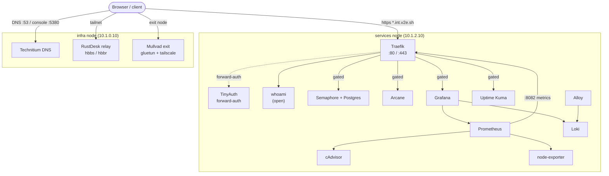

# Application estate

Every user-facing service in the lab runs as a Docker Compose stack. This page maps each
stack to what it does, where it lives, how it is reached, and whether it is gated behind
authentication. It is the reference for the running application surface, grounded in the
compose definitions under `v2e-compose/`.

The estate is split across two nodes, and the split is deliberate:

- The `services` node (`10.1.2.10`, VLAN 102) carries the web application estate.
  Everything here sits behind Traefik and, for the sensitive applications, TinyAuth. Each
  application is published as `https://<app>.int.v2e.sh` with a Let's Encrypt wildcard
  certificate. The enabled stacks are listed in `v2e-ansible` `group_vars/services.yml`.
- The `infra` node (`10.1.0.10`, management VLAN 100) carries foundational appliances that
  require the host network — DNS, a remote-desktop relay, and an optional VPN exit. These
  are not fronted by Traefik and do not live under `int.v2e.sh`; they are reached directly
  on the LAN or over Tailscale. The enabled stacks are listed in `group_vars/infra.yml`.

Hostnames derive from `INTERNAL_DOMAIN=int.v2e.sh`; the public zone `DOMAIN=v2e.sh` is used
for ACME registration and email only.

## At a glance

| Application | URL | Node | Purpose | Gated? |
|---|---|---|---|---|
| Traefik dashboard | `traefik.int.v2e.sh` | `services` | Reverse proxy / TLS terminator; dashboard | TinyAuth |
| TinyAuth | `tinyauth.int.v2e.sh` | `services` | Forward-auth provider (the gate itself) | Public login page |
| whoami | `whoami.int.v2e.sh` | `services` | Request-echo / connectivity probe | Open |
| Semaphore | `semaphore.int.v2e.sh` | `services` | Ansible/task runner UI (+ Postgres) | TinyAuth |
| Arcane | `arcane.int.v2e.sh` | `services` | Docker stack manager | TinyAuth |
| Grafana | `grafana.int.v2e.sh` | `services` | Metrics/logs dashboards | TinyAuth |
| Uptime Kuma | `uptime.int.v2e.sh` | `services` | Uptime/status monitoring | TinyAuth |
| Prometheus | *(internal only)* | `services` | Metrics store; surfaced through Grafana | No route |
| Loki | *(internal only)* | `services` | Log store; surfaced through Grafana | No route |
| Alloy | *(internal only)* | `services` | Log/metric collector to Loki | No route |
| node-exporter | *(host network)* | `services` | Host metrics for Prometheus | No route |
| cAdvisor | *(internal only)* | `services` | Container metrics for Prometheus | No route |
| Technitium | `infra:5380` (HTTP) | `infra` | Internal DNS server + admin console | LAN / tailnet only |
| RustDesk (hbbs/hbbr) | *(host ports)* | `infra` | Self-hosted remote-desktop relay | Tailnet only |
| Mullvad exit | *(Tailscale exit node)* | `infra` | Mullvad-tunnelled exit node | Tailnet only |

!!! info "What gated means"
    A gated application carries the `auth@docker` middleware — TinyAuth's forward-auth. A
    request to it is redirected to the TinyAuth login before it ever reaches the
    application. Open applications carry only `secure-headers@docker`. Applications with no
    Traefik route are unreachable over HTTPS: they are internal to a Docker network, or
    exposed on the LAN or tailnet outside the proxy.

## How the pieces relate



## The applications

### Traefik — the front door

Traefik `v3.7.6` terminates TLS on `:443` (with a `:80` to `:443` redirect) and routes by
`Host()` header to every stack on the `frontend` Docker network. It obtains a wildcard
`*.int.v2e.sh` certificate over the ACME DNS-01 challenge via Cloudflare, and carries two
resolvers — `staging` and `production` — selected by `CERT_RESOLVER`.

- The dashboard is published at `traefik.int.v2e.sh` and is gated (`auth@docker`). Its
  router also anchors the wildcard certificate through `tls.domains[0].main` plus the `*`
  SAN.
- A reusable `secure-headers` middleware (frame-deny, no-sniff, XSS filter, referrer
  policy) is applied to every router.
- Prometheus metrics are exposed on a dedicated container-internal entrypoint `:8082`,
  scraped over the `frontend` network and never published.

!!! warning "DNS-01 and the lab's DNS interceptor"
    Both resolvers set `propagation.delayBeforeChecks=60s` and `disableChecks=true`. The
    lab's WAN path runs a caching DNS interceptor that negative-caches the
    `_acme-challenge` lookup, poisoning any on-node self-check. Traefik sleeps 60s after
    the Cloudflare write and lets Let's Encrypt validate from its own resolvers. Do not pin
    `resolvers=1.1.1.1` here — it falls into the same negative-cache trap.

### TinyAuth — the gate

TinyAuth `v5.0.7` (`ghcr.io/steveiliop56/tinyauth`) is a backend-neutral forward-auth
provider. It publishes the `auth` middleware
(`forwardauth.address=http://tinyauth:3000/api/auth/traefik`) that every gated application
references as `auth@docker`. On success it injects `Remote-User`, `Remote-Groups`,
`Remote-Email`, and `Remote-Name` headers.

Its own login page at `tinyauth.int.v2e.sh` is public by design — a forward-auth service
cannot gate its own login, so that router carries only `secure-headers`. Users are defined
in `TINYAUTH_AUTH_USERS`, supplied from SOPS.

### whoami — the open probe

whoami `v1.11.0` (`traefik/whoami`) echoes the incoming HTTP request. It is the one
application with no auth (only `secure-headers`), used to confirm routing, TLS, and
connectivity end to end. It is a scratch image with no shell, so it carries no container
healthcheck; liveness is covered by Traefik's router state and Uptime Kuma.

### Semaphore — automation UI

Semaphore `v2.18.14` (`semaphoreui/semaphore`) runs with a dedicated `postgres:18.4-alpine`
database and provides the Ansible/task runner web UI. It is gated with TinyAuth in front of
Semaphore's own login, giving two layers of authentication.

- Postgres sits on an `internal` network reachable only by Semaphore.
- Semaphore also publishes `:3000` on the LAN so its remote runner — which lives on the
  `control` node as the `ansible` user, next to the mesh SSH keys — can poll the server
  outbound. The runner cannot come through Traefik, since TinyAuth would reject its API
  calls with 401, so it reaches the LAN-published `:3000` directly. The VyOS firewall
  permits the `control` to `services` path; the public hostname stays gated.
- The first-boot admin is bootstrapped as `admin`. `SEMAPHORE_ACCESS_KEY_ENCRYPTION`
  (from SOPS) encrypts stored credentials; rotating it invalidates every stored key.

### Arcane — Docker manager

Arcane `v2.3.0` (`ghcr.io/getarcaneapp/manager`) is a UI to view and manage the running
compose stacks, pointed at the deployed projects via `PROJECTS_DIRECTORY=/opt/v2e-compose`.
It is gated with TinyAuth in front of its own login.

!!! warning "Privileged by design"
    Arcane mounts the Docker socket read-write (root-equivalent on the `services` host) and
    runs with `cgroup: host` so it can detect its own container. Its first-boot login is
    `admin`/`password` — change it immediately in the UI. Upstream ships a
    docker-socket-proxy example for tightening the socket mount if required.

### Observability — Grafana, Prometheus, Loki, and exporters

The observability stack is defined in a single `observability/compose.yml`. Only two of its
services get Traefik routes; everything else is internal and surfaced through Grafana.

- Grafana `13.0.3` is published at `grafana.int.v2e.sh` and gated. Sign-up is disabled and
  the admin password comes from SOPS (`GRAFANA_ADMIN_PASSWORD`).
- Uptime Kuma `2.4.0-slim` (`louislam/uptime-kuma`) is published at `uptime.int.v2e.sh` and
  gated. It also probes the `infra` appliances over the tailnet.
- Prometheus `v3.13.0` is the metrics store; it scrapes cAdvisor, node-exporter, and
  Traefik's `:8082`. No route.
- Loki `3.7.3` and Alloy `v1.17.1` are the log store and collector; Alloy tails the Docker
  socket and ships to Loki. No routes.
- node-exporter `v1.11.1` (host network, host PID) and cAdvisor `v0.60.3` provide host and
  container metrics. No routes.

!!! note "Memory budget"
    The `services` node is a 4 GB VM, so every container in this stack is memory-capped
    (Loki and Alloy also set `GOMEMLIMIT` to force GC ahead of the OOM killer), keeping the
    whole observability stack under a roughly 1.2 GiB hard cap.

### Technitium — internal DNS

Technitium `15.2.0` (`technitium/dns-server`) runs on the `infra` node using the host
network. It owns the node's `:53` (TCP and UDP) and serves its admin console on `:5380`. It
is the authoritative resolver for the `int.v2e.sh` zone (wildcard to `services`, plus
per-node A records) and forwards everything else upstream (`NAME_SERVERS`, default
`1.1.1.1, 9.9.9.9`).

It is not behind Traefik and not under `int.v2e.sh`. Reach the console directly at
`http://<infra-ip>:5380` from the LAN subnet or over Tailscale.

!!! warning "Plaintext console"
    The `:5380` console is HTTP only, contained to the control subnet and tailnet. Host
    networking is required so per-client DNS rules see real client source IPs; port
    publishing would rewrite them.

### RustDesk relay — remote desktop

RustDesk server `1.1.15` (`rustdesk/rustdesk-server`) runs as two containers on the `infra`
node using the host network — `hbbs` (rendezvous/ID) and `hbbr` (relay). RustDesk spreads
across TCP/UDP `21114-21119` plus `21116/udp`, and `hbbs` must see real client source
addresses, so host networking is required. The relay is internal and Tailscale-only: there
is no WAN DNAT. Clients reach the `control` desktop via direct IP over Tailscale rather than
through a public RustDesk server. There is no web UI and no Traefik route.

### Mullvad exit — VPN egress

The Mullvad exit is a portable stack on the `infra` node, enabled in `group_vars/infra.yml`.
gluetun `v3.41.1` (`qmcgaw/gluetun`) brings up a Mullvad WireGuard tunnel, and a Tailscale
`v1.98.4` sidecar shares gluetun's network namespace and advertises itself as an exit node
named `mullvad`. Any tailnet device selecting it egresses through Mullvad.

The stack is namespace-isolated so Mullvad's WireGuard never touches the host routing table,
letting it run safely beside the Technitium DNS server and RustDesk relay. There is no web UI;
the node appears only in the Tailscale exit-node picker, and the compose file is identical to a
standalone VPS deployment given the same environment. See
[Tailscale, exit nodes & DNS](tailscale-dns.md) for the gluetun kill-switch, the Tailscale
CGNAT allowlist, and the full namespace-isolation model.

## Authentication model

```mermaid
flowchart LR
    req([Request to *.int.v2e.sh]) --> t{Traefik router}
    t -->|whoami| open[secure-headers only → app]
    t -->|tinyauth| login[public login page]
    t -->|traefik / semaphore / arcane<br/>grafana / uptime| gate{auth@docker}
    gate -->|no session| login
    gate -->|valid session| app2[secure-headers → app's own login]
```

Gated applications stack two layers: TinyAuth forward-auth, then the application's own login
(Semaphore, Arcane, and Grafana all keep their native auth). whoami is deliberately open, and
the `infra` appliances sit entirely outside this HTTP path.

## Related

- [Network, VLANs & firewall](networking.md) — VLAN layout, the VyOS firewall, and the Traefik ingress path.
- [Observability & alerting](observability.md) — the metrics and logging pipeline behind Grafana.
- [Tailscale, exit nodes & DNS](tailscale-dns.md) — the tailnet, Technitium, and exit-node routing.
- [Secrets & SOPS flow](secrets.md) — how SOPS renders the credentials these stacks consume.
