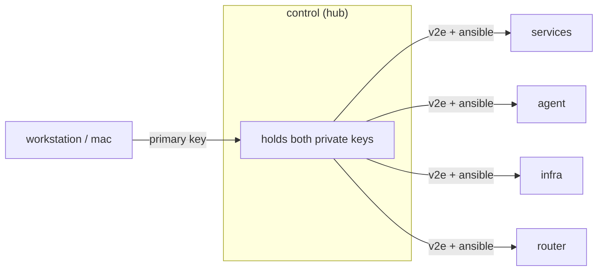
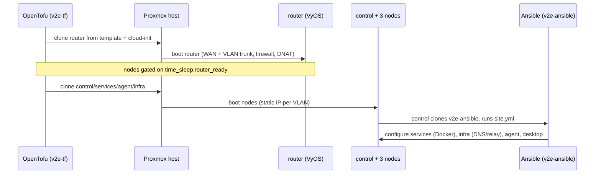

# Architecture overview

The v2e lab is a single Proxmox host running **five VMs**: one VyOS router and four
workload nodes, each isolated on its own VLAN behind a default-deny firewall. This page
describes what each VM does, how the network is segmented, and how the pieces fit
together.

!!! note "Source of truth"
    Node inventory and IPs come from `HANDOVER.md` §1; the topology model, VLANs, and node
    definitions come from `v2e-tf/nodes.tf` and `v2e-tf/network.tf`. Sizing (vCPU/RAM) in the
    table below reflects the **live** deployment (tfvars), which overrides the smaller
    variable defaults.

---

## The host

Everything runs on one Proxmox VE host, **`pve`** at `10.10.10.62` (web UI
`https://10.10.10.62:8006`). All five guests are cloned from Proxmox templates built by
`v2e-templates`, then customised at first boot via cloud-init (rendered by OpenTofu in
`v2e-tf`).

The host presents two bridges to the guests:

- **`vmbr0` — WAN.** The router's first NIC (`eth0`) attaches here for its uplink.
- **`vmbr1` — LAN trunk.** The router's second NIC (`eth1`) is a VLAN trunk carrying tags
  `100`, `101`, `102`, `103`. Every workload node has a single access port tagged into
  exactly one of those VLANs.

---

## The five VMs

| VMID | Node | OS | vCPU / RAM | VLAN | IP | Gateway | Role |
|---|---|---|---|---|---|---|---|
| 310 | `router` | VyOS | 1 / 1G | trunk (100–103) | `10.1.x.1` (per-VLAN gateway) | — | Router, DNAT, default-deny firewall |
| 311 | `control` | ParrotOS (UEFI desktop) | 4 / 8G | 101 | `10.1.1.10` | `10.1.1.1` | Mesh hub, Ansible controller, Tailscale subnet router, RustDesk target |
| 312 | `services` | Ubuntu | 4 / 4G | 102 | `10.1.2.10` | `10.1.2.1` | Docker app estate (Traefik + apps) |
| 313 | `agent` | Debian | 4 / 4G | 103 | `10.1.3.10` | `10.1.3.1` | AI agent node (restricted egress) |
| 314 | `infra` | Debian | 2 / 2G | 100 (mgmt) | `10.1.0.10` | `10.1.0.1` | Technitium DNS + RustDesk relay (Docker) |

!!! info "VMID scheme"
    The router is a fixed `vyos_vmid = 310`. The four nodes are derived from
    `node_vmid_base` (default `310`): `control = base+1`, `services = base+2`,
    `agent = base+3`, `infra = base+4` — giving `311`–`314`. Each node's static IP is
    `<network_prefix>.<subnet-octet>.<node_host_octet>`, i.e. the shared last octet `.10`
    on each VLAN.

### router (VyOS, 310)

The gateway for the whole lab. Created **first**; the four nodes wait on a `time_sleep`
(`router_ready`) so routing and firewall are live before they boot. It terminates the WAN
uplink (`eth0` on `vmbr0`) and trunks the four internal VLANs on `eth1` (`vmbr1`), owning
the `.1` gateway address in each subnet.

It enforces a **default-deny firewall**, DNATs one WAN port to control's SSH
(`control_ssh_wan_port` `2201` → control `:22`), and applies a restricted egress allowlist
to the agent VLAN. At Terraform time it comes up with only the default `vyos` login,
authorised for the workstation key plus both mesh keys; Ansible then owns the rest of the
router config.

### control (ParrotOS, 311)

The lab's hub and workstation. It is the only node built as a **UEFI desktop** (BIOS
`ovmf`, a virtio display) rather than a headless cloud image. Its jobs:

- **Mesh hub** — holds the private keys for both SSH trust meshes (`v2e` human admin and
  `ansible` automation) and can reach every other node **and** the router.
- **Ansible controller** — at first boot it clones `v2e-ansible` and runs `site.yml`
  against the mesh, as the dedicated `ansible` account.
- **Tailscale subnet router** — advertises `10.1.0.0/16` onto the tailnet so the
  workstation can reach lab services; carries the RustDesk desktop target.

### services (Ubuntu, 312)

The Docker application estate, fronted by **Traefik + TinyAuth** on `int.v2e.sh` with a
production Let's Encrypt wildcard cert. Stacks: traefik, tinyauth, whoami, semaphore
(+postgres), arcane, and observability (prometheus, grafana, loki, alloy, uptime-kuma,
node-exporter, cadvisor).

### agent (Debian, 313)

The AI agent node, placed on its own VLAN with **deny-by-default internet egress**
(`agent_egress_restricted`). It reaches the internet only through an allowlist (DNS to
the configured resolvers, NTP, and specific TCP ports) — a zero-trust boundary for the AI
workload.

### infra (Debian, 314)

A small **infrastructure appliance** on the otherwise-empty management VLAN (`100`), so
foundational services live in their own failure domain, off the churny services node. It
runs (in Docker): **Technitium** — internal DNS authoritative for the `int.v2e.sh` zone,
resolving the wildcard to services (`10.1.2.10`) — and the **RustDesk** relay (hbbs/hbbr).
It is reachable by control for management, queried on `:53` by the lab, and keeps open
egress for image/update pulls.

---

## Network topology

Each VLAN is a `/24` (`10.1.<octet>.0/24`) with the router at `.1` and the node at `.10`:

| VLAN | Subnet | Gateway (router) | Node |
|---|---|---|---|
| 100 (mgmt) | `10.1.0.0/24` | `10.1.0.1` | `infra` (`10.1.0.10`) |
| 101 | `10.1.1.0/24` | `10.1.1.1` | `control` (`10.1.1.10`) |
| 102 | `10.1.2.0/24` | `10.1.2.1` | `services` (`10.1.2.10`) |
| 103 | `10.1.3.0/24` | `10.1.3.1` | `agent` (`10.1.3.10`) |

!!! warning "Spokes are isolated by design"
    The VyOS firewall isolates the VLAN spokes from each other. Cross-node reachability
    (e.g. Prometheus on `services` scraping node-exporter on other VMs) is deliberately
    limited — it is not a flat network. Management access flows from `control` (the hub)
    outward, not spoke-to-spoke.

---

## SSH trust meshes

Access between nodes is organised as two **meshes**, each a single login user present on
every node with one keypair whose private half lives only on the hub (`control`):

- **`primary` (`v2e`)** — the human admin login. Hub = control; the workstation key is
  authorised on the hub. Sudo requires a password.
- **`ansible`** — the automation account. Hub = control; reaches every node **and** the
  VyOS router with NOPASSWD sudo. Phase-2 Ansible runs from here.

Both mesh keys are authorised on the router's default `vyos` user, so control reaches it
as `vyos@10.1.1.1` for the bootstrap.

---

## How it all comes together

1. **`tofu apply`** (in `v2e-tf`) builds the router first, then the four nodes once the
   router is ready.
2. Cloud-init seeds each node's users, keys, and static IP; only `control` receives the
   Ansible bootstrap, the Cloudflare tunnel token (when enabled), and the SOPS
   secrets + age key.
3. **Control auto-runs `v2e-ansible`** at first boot — `site.yml` imports all six
   phases: `01-bootstrap → 02-services → 03-applications → 04-infra → 05-tailscale
   → 06-control-desktop`, bringing up the Docker stacks defined in `v2e-compose` on
   `services` and `infra`, then joining the tailnet and configuring the desktop.

!!! tip "Where to go next"
    - Deploy walk-through: **RUNBOOK.md**
    - Every variable (tfvars / SOPS / group_vars): **CONFIGURATION.md**
    - Current live state, access paths, and backlog: `HANDOVER.md`
