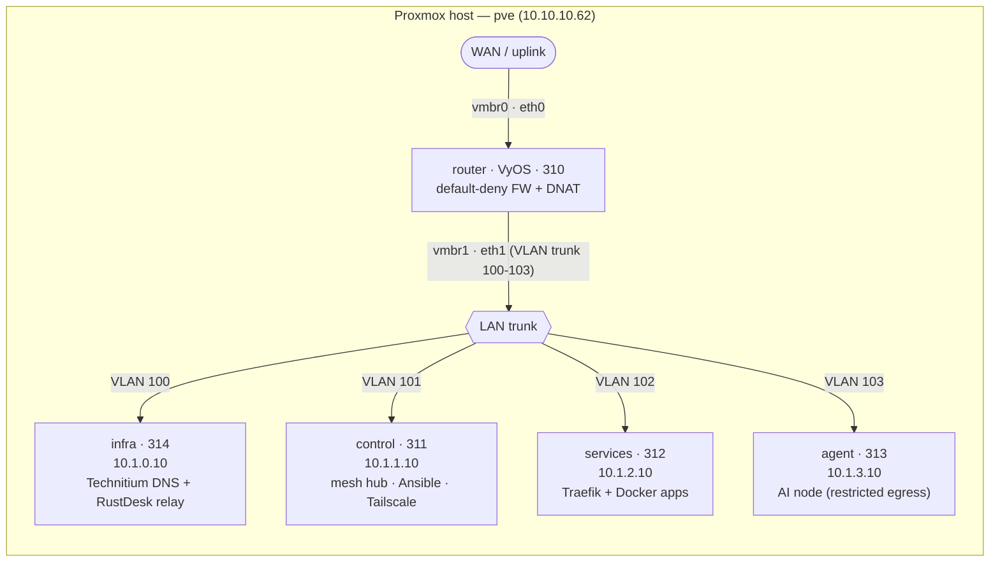
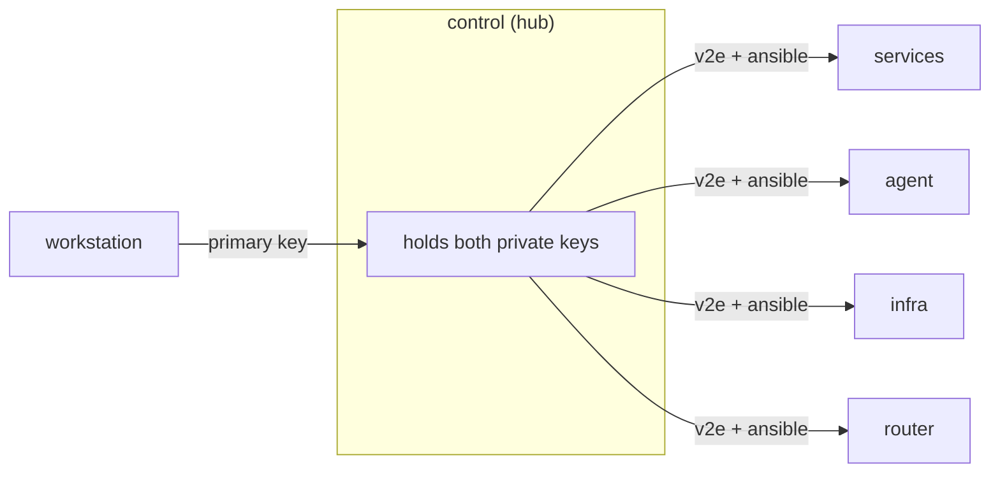
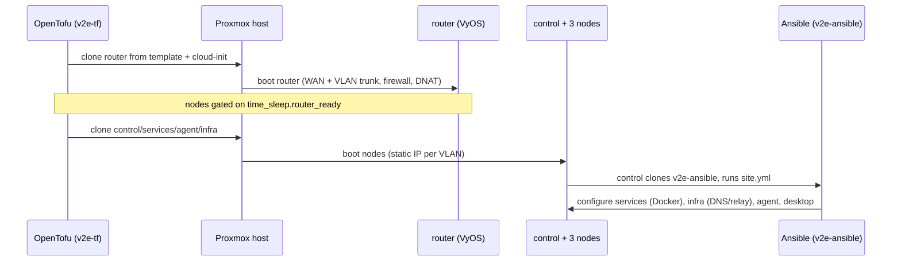

# Architecture overview

The v2e lab runs on a single Proxmox host as five virtual machines: one VyOS router and
four workload nodes, each isolated on its own VLAN behind a default-deny firewall. This
page describes what each VM does, how the network is segmented, and how the pieces fit
together into one lab.

The whole topology is derived in code from a handful of variables, so the model is
consistent end to end: the router owns the `.1` gateway in every subnet, each node holds
the `.10` host address in exactly one VLAN, and access between machines is mediated by two
SSH trust meshes hubbed on the control node.

## The host

Everything runs on one Proxmox VE host, `pve`, reached at `https://10.10.10.62:8006`
(`proxmox_endpoint` and `node_name` in `v2e-tf/terraform.tfvars`). All five guests are
full clones of Proxmox templates produced by `v2e-templates`, then customised at first
boot by cloud-init that OpenTofu renders in `v2e-tf`.

The host presents two bridges to the guests (`wan_bridge` and `lan_bridge` in
`v2e-tf/variables.tf`):

- `vmbr0` — WAN. The router's first NIC (`eth0`) attaches here for its uplink.
- `vmbr1` — LAN trunk. The router's second NIC (`eth1`) is a VLAN trunk carrying tags
  `100`, `101`, `102`, `103`. Every workload node has a single access port tagged into
  exactly one of those VLANs.

## The five VMs

Sizing below is the effective deployment: variable defaults from `v2e-tf/variables.tf`,
with `node_memory` raised to `4096` for the services and agent nodes in
`v2e-tf/terraform.tfvars` (2 GB was OOM-tight for the full compose estate).

| VMID | Node | OS | vCPU / RAM | Disk | VLAN | IP | Gateway | Role |
|---|---|---|---|---|---|---|---|---|
| `310` | `router` | VyOS | 1 / 1 GB | 10 GB | trunk (100–103) | `.1` per VLAN | — | Router, DNAT, default-deny firewall |
| `311` | `control` | ParrotOS (UEFI desktop) | 4 / 8 GB | 64 GB | `101` | `10.1.1.10` | `10.1.1.1` | Mesh hub, Ansible controller, Tailscale subnet router, RustDesk target |
| `312` | `services` | Ubuntu | 2 / 4 GB | 20 GB | `102` | `10.1.2.10` | `10.1.2.1` | Docker application estate (Traefik + apps) |
| `313` | `agent` | Debian | 2 / 4 GB | 20 GB | `103` | `10.1.3.10` | `10.1.3.1` | AI agent node (restricted egress) |
| `314` | `infra` | Debian | 2 / 2 GB | 20 GB | `100` (mgmt) | `10.1.0.10` | `10.1.0.1` | Technitium DNS + RustDesk relay (Docker) |

!!! info "VMID and address scheme"
    The router takes a fixed `vyos_vmid = 310`. The four nodes are derived from
    `node_vmid_base` (default `310`): `control = base+1`, `services = base+2`,
    `agent = base+3`, `infra = base+4`, giving `311`–`314`. Each node's static IP is
    `<network_prefix>.<subnet-octet>.<node_host_octet>` — the shared last octet `.10`
    (`node_host_octet`) on its own VLAN. All of this is defined in `v2e-tf/network.tf`.

### router (VyOS, 310)

The gateway for the whole lab, and the only VM created first: the four nodes depend on a
`time_sleep` (`router_ready`, default `120s` via `router_boot_wait`) so routing and
firewall are live before they boot. The router terminates the WAN uplink (`eth0` on
`vmbr0`, a static `10.11.10.25/24` in the live tfvars) and trunks the four internal VLANs
on `eth1` (`vmbr1`), owning the `.1` gateway address in each subnet.

It enforces a default-deny firewall (`firewall_enabled`), DNATs one WAN port to the
control node's SSH (`control_ssh_wan_port` `2201` → control `:22`), and applies a
restricted egress allowlist to the agent VLAN. At OpenTofu time it comes up with only the
default `vyos` login, authorised for the workstation key plus both mesh keys; Ansible then
owns the rest of the router configuration.

### control (ParrotOS, 311)

The lab's hub and workstation, and the only node built as a UEFI desktop (`bios = ovmf`,
given a virtio display) rather than a headless cloud image. Its roles:

- Mesh hub — holds the private keys for both SSH trust meshes (`v2e` human admin and
  `ansible` automation) and can reach every other node and the router.
- Ansible controller — at first boot it clones `v2e-ansible` and runs `site.yml` against
  the mesh, as the dedicated `ansible` account.
- Tailscale subnet router — advertises the lab subnets onto the tailnet so the workstation
  can reach lab services, and carries the RustDesk desktop target.

### services (Ubuntu, 312)

The Docker application estate, fronted by Traefik and TinyAuth on `int.v2e.sh` with a
production Let's Encrypt wildcard certificate. It runs the traefik, tinyauth, whoami,
semaphore (with postgres), and arcane stacks, plus observability (prometheus, grafana,
loki, alloy, uptime-kuma, node-exporter, cadvisor).

### agent (Debian, 313)

The AI agent node, placed on its own VLAN with deny-by-default internet egress
(`agent_egress_restricted = true`). It reaches the internet only through an allowlist —
DNS to the configured resolvers, NTP, and the TCP ports in `agent_egress_allow_tcp_ports`
(default `80`, `443`) — a zero-trust boundary for the AI workload.

### infra (Debian, 314)

A small infrastructure appliance on the otherwise-empty management VLAN (`100`), so
foundational services live in their own failure domain, off the churnier services node. In
Docker it runs Technitium — internal DNS authoritative for the `int.v2e.sh` zone,
resolving the wildcard to the services node (`10.1.2.10`) — and the RustDesk relay
(`hbbs`/`hbbr`). It is reachable from control for management, queried on `:53` by the lab,
and keeps open egress for image and update pulls.

## Network topology

Each VLAN is a `/24` (`10.1.<octet>.0/24`, from `network_prefix` and `subnet_mask`) with
the router at `.1` and its node at `.10`:

| VLAN | Subnet | Gateway (router) | Node |
|---|---|---|---|
| `100` (mgmt) | `10.1.0.0/24` | `10.1.0.1` | `infra` (`10.1.0.10`) |
| `101` | `10.1.1.0/24` | `10.1.1.1` | `control` (`10.1.1.10`) |
| `102` | `10.1.2.0/24` | `10.1.2.1` | `services` (`10.1.2.10`) |
| `103` | `10.1.3.0/24` | `10.1.3.1` | `agent` (`10.1.3.10`) |

!!! warning "Spokes are isolated by design"
    The VyOS firewall isolates the VLAN spokes from one another. Cross-node reachability
    (for example, Prometheus on the services node scraping node-exporter elsewhere) is
    deliberately limited — this is not a flat network. Management access flows from the
    control node outward, not spoke to spoke.

## SSH trust meshes

Access between nodes is organised as two meshes, each defined in `v2e-tf/network.tf`. A
mesh is a single login user present on every node, backed by one keypair whose private
half lives only on the hub node (`control`); every node authorises the matching public
key.

- `primary` (`v2e`) — the human admin login. Hub is control; the workstation key is
  authorised on the hub. Sudo requires a password (`sudo_password`).
- `ansible` — the automation account (`ansible_user`). Hub is control; it reaches every
  node and the VyOS router with NOPASSWD sudo. The first-boot Ansible run executes as this
  user.

Both mesh public keys, along with the workstation key, are authorised on the router's
default `vyos` user (`admin_keys` in `v2e-tf/router.tf`), so control reaches the router as
`vyos@10.1.1.1` for the bootstrap before Ansible provisions dedicated router users.

## How it all comes together

1. `tofu apply` in `v2e-tf` builds the router first, then the four nodes once the router
   is ready.
2. Cloud-init seeds each node's users, keys, and static IP. Only the control node also
   receives the Ansible bootstrap, the Cloudflare tunnel token (when enabled), and the
   SOPS secrets plus age key — the gating logic lives in `v2e-tf/nodes.tf`.
3. The control node auto-runs `v2e-ansible` at first boot: `site.yml` imports every phase
   (`01-bootstrap → 02-services → 03-applications → 04-infra → 05-tailscale →
   06-control-desktop`), bringing up the Docker stacks defined in `v2e-compose` on the
   services and infra nodes, then joining the tailnet and configuring the desktop.

## Related

- [Network, VLANs & firewall](networking.md) — the VyOS trunk, subnets, and default-deny rules in detail.
- [Deploy & bootstrap lifecycle](lifecycle.md) — the full apply-to-configured sequence.
- [Application estate](applications.md) — the Traefik-fronted stacks on the services node.
- [Secrets & SOPS flow](secrets.md) — how control decrypts and distributes secrets.
- [Tailscale, exit nodes & DNS](tailscale-dns.md) — remote access and name resolution.
