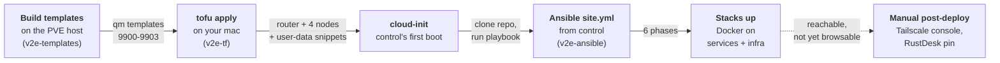
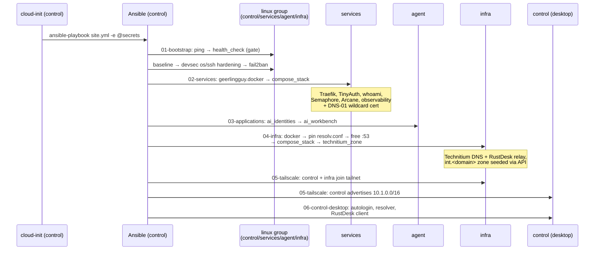

# Deploy & bootstrap lifecycle

How the lab goes from a bare Proxmox host to apps served over HTTPS, in one pass.
This page traces the *mechanics* of the flow — who hands off to whom, in what
order, and where it can stall. For the step-by-step operator walk-through with
copy-paste commands, see [`RUNBOOK.md`](../RUNBOOK.md); for every variable,
[`CONFIGURATION.md`](../CONFIGURATION.md).

## The chain of custody

The deploy is a relay: each stage builds an artifact the next stage consumes.
No single tool drives the whole thing end to end.



| Stage | Runs on | Tool | Artifact it produces |
|---|---|---|---|
| 1. Templates | PVE host | `virt-customize` + `qm` | `qm template` per image (VMIDs 9900–9903) |
| 2. `tofu apply` | your mac | OpenTofu + bpg proxmox provider | VyOS router + 4 node VMs + cloud-init snippets |
| 3. cloud-init | control (first boot) | cloud-init | Ansible installed, repo cloned, secrets staged |
| 4. `site.yml` | control | Ansible | hardened nodes, Docker, rendered `.env` files |
| 5. Stacks | services + infra | Docker Compose (via `compose_stack`) | Traefik/TinyAuth/observability/DNS/relay containers |
| 6. Post-deploy | Tailscale console + control | manual | browser access + RustDesk |

!!! note "cloud-init runs **once** per VM"
    A tfvars change never re-applies to a live VM — you must `-replace` the VM
    (Day-2 in the RUNBOOK). Ansible, by contrast, is re-runnable any time from
    control. This split is why almost all *configuration* lives in Ansible and
    only *provisioning* lives in cloud-init.

## Ordering inside `tofu apply`

The router must be routing before the nodes boot, or their first-boot `apt` step
fails (no path to the internet). OpenTofu enforces this with an explicit sleep,
not just a dependency edge:

- `proxmox_virtual_environment_vm.vyos` is created **first**.
- `time_sleep.router_ready` waits `router_boot_wait` (default **120s**) for VyOS
  to boot and apply its routing + firewall.
- All four `proxmox_virtual_environment_vm.node[*]` `depends_on` that sleep, so
  they only start cloning once the wait elapses.

The router is configured **entirely by Terraform cloud-init**
(`cloud-init/vyos-router.yaml.tftpl`) — WAN/LAN interfaces, the four VLAN
gateways, DNAT (`:2201` → control `:22`), and the default-deny firewall. VyOS is
**not** touched by the unattended `site.yml` (its hardening is an on-demand ops
playbook). Firewall changes therefore mean editing the template and rebuilding
the router with `-replace`; live `set firewall` edits are wiped on rebuild.

!!! warning "Router boot too slow → nodes fail apt"
    If a node's package stage fails on first boot, VyOS wasn't routing yet — bump
    `router_boot_wait`. Login still works (users/keys are set before packages),
    so you can SSH in and inspect.

## Inside control's cloud-init

Only the **control** node gets the bootstrap logic; the other three node
user-data files render the Ansible/SOPS/cloudflared blocks empty (byte-identical
to a no-bootstrap node). This is gated in `nodes.tf` on `k == "control"`.

What control's `runcmd` does, in order (`cloud-init/node.yaml.tftpl`):

1. **Optional Cloudflare tunnel connector** — best-effort (`|| true`); a tunnel
   hiccup never fails the deploy. The SSH DNAT already covers remote access.
2. **Install Ansible** for the `ansible` user via `pipx install --include-deps`
   (user-isolated under `~/.local`).
3. **Clone v2e-ansible** (`ansible_repo_url` / `ansible_repo_ref`, idempotent).
4. **Decrypt SOPS secrets** — if configured, `secrets.sops.yaml` is installed to
   `group_vars/all.sops.yaml` *and* decrypted to `~/.v2e-secrets.yml`.
5. **Install Galaxy deps** from `requirements.yml` (roles + collections).
6. **Wait for the mesh** — `ansible all:!vyos -m wait_for_connection` (VyOS
   excluded: its `vyos` login is the VyOS CLI, not a Python shell). Best-effort.
7. **Run the playbook** — `ansible-playbook -i inventory/hosts.ini site.yml`,
   with `-e @~/.v2e-secrets.yml` appended when SOPS is set.

!!! note "Why secrets are passed as `-e @file`, not just group_vars"
    The `community.sops` vars plugin returns group_vars **empty** during the full
    multi-phase run — `geerlingguy.docker`'s `meta: reset_connection` drops
    demand-mode vars. `compose_stack`'s secret assertions need values from a
    source resolved once and never re-derived, so cloud-init also decrypts to
    `~/.v2e-secrets.yml` and passes it as highest-precedence extra-vars.

Control is the **mesh hub**: its cloud-init drive carries the mesh SSH private
keys and `~/.ssh/config`, so the `ansible` user reaches `services`, `agent`,
`infra`, and the router by alias with no extra credentials. Treat that VM's
disk/snapshots as key material.

## Inside `site.yml` — the six phases

`site.yml` statically imports six phase playbooks in order. The `health_check`
role in phase 01 is the **fail-fast gate**: if a node is unreachable or
misconfigured, the run stops before anything is changed.



| Phase | Playbook | Hosts | Roles / effect |
|---|---|---|---|
| 01 | `01-bootstrap.yml` | `linux` (all 4 nodes) | ping smoke test → `health_check` (fail-fast) → `baseline` → `devsec.hardening` os + ssh → `fail2ban` |
| 02 | `02-services.yml` | `services` | `geerlingguy.docker` → `compose_stack` (Traefik/TinyAuth/whoami/Semaphore/Arcane/observability) |
| 03 | `03-applications.yml` | `agent` | `ai_identities` → `ai_workbench` (AI-agent accounts + workbench, agent node only) |
| 04 | `04-infra.yml` | `infra` | `geerlingguy.docker` → pin `resolv.conf` + free `:53` → `compose_stack` (Technitium/RustDesk relay) → `technitium_zone` (seed `int.<domain>` via API) |
| 05 | `05-tailscale.yml` | `control:infra` | `tailscale` — control becomes subnet router for `10.1.0.0/16`; infra joins directly. Skips gracefully if `tailscale_authkey` absent |
| 06 | `06-control-desktop.yml` | `control` | `control_desktop` (lightdm autologin, compositor off, resolver → Technitium) → `rustdesk_client` |

!!! note "The `:53` handoff on infra (phase 04) is ordered for safety"
    resolv.conf is pinned to the upstream resolvers **first**, so the node's own
    name resolution never depends on the Technitium container it's about to run.
    Only then is the systemd-resolved stub listener disabled to free `:53`, and
    the stacks deployed. A container restart can't take down the node's DNS.

!!! tip "Graceful skips keep the unattended run green"
    Phases 05 and 06 skip their not-yet-configured pieces (empty
    `tailscale_authkey`, unpinned `rustdesk_client_version`) with a warning rather
    than failing. Set the value later and re-run Ansible to pick them up.

## When it's done — verifying convergence

Allow **10–20 minutes** after `apply` finishes. Then, from control:

- `sudo cloud-init status --long` → `done`
- `sudo grep -A5 'PLAY RECAP' /var/log/cloud-init-output.log` → `failed=0` on every host
- `ssh services docker ps` → all stacks `Up (healthy)`
- `ssh services docker logs traefik | grep -i 'certificates obtained'` → wildcard cert issued (DNS-01, no inbound ports)

At this point the apps answer over HTTPS from *inside* the lab, but the internal
name `int.<domain>` isn't resolvable from your mac yet — that's the manual step
below. Verify with `curl --resolve <app>.int.<domain>:443:10.1.2.10`.

## What stays manual after convergence

Everything reproducible is codified; what remains is genuinely outside the lab's
control plane (tailnet-side settings and one client-side release pin).


1. **Tailscale admin console** (once phase 05 has joined with an authkey):
   **approve** control's advertised route `10.1.0.0/16` and set **split-DNS**
   `int.<domain>` → `10.1.0.10` (Technitium). That gives your mac browser access
   to every app.
2. **RustDesk** — already pinned (`rustdesk_client_version: "1.4.8"` +
   `.deb` sha256 in `inventory/group_vars/control.yml`), so the role installs it
   unattended; the skip-with-warning behaviour only applies if you blank the pin.
   Connect via **Direct IP** to control's tailnet IP with `rustdesk_unattended_password`.
3. **Anything skipped in secrets** (e.g. an empty `tailscale_authkey`)
   is picked up by re-running Ansible from control:
   ```bash
   sudo -iu ansible bash -lc 'cd ~/ansible && \
     ansible-playbook -i inventory/hosts.ini site.yml -e @~/.v2e-secrets.yml'
   ```

!!! warning "macOS DNS caveats"
    If Tailscale split-DNS is flaky, pin a native resolver:
    `echo 'nameserver 10.1.0.10' | sudo tee /etc/resolver/int.<domain>`. Note
    that Mullvad VPN hijacks DNS while connected and breaks internal resolution.

## Rebuild vs re-converge

| You want to… | Do this |
|---|---|
| Change a node's cloud-init / provisioning | `tofu apply -replace='proxmox_virtual_environment_vm.node["<name>"]'` |
| Change the router / firewall | `tofu apply -replace='proxmox_virtual_environment_vm.vyos'` |
| Change Ansible-managed config | re-run `site.yml` from control (no rebuild) |
| Tear it all down | `tofu destroy` (also removes the tunnel + CNAME) |

Because cloud-init runs once, tfvars edits that affect a live VM require a
`-replace`; everything Ansible owns is just a re-run. That is the deliberate line
between the two tools.
