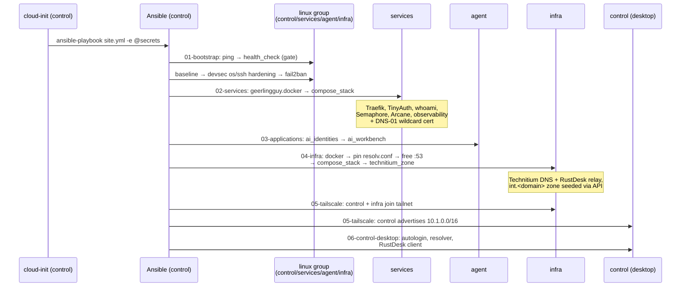
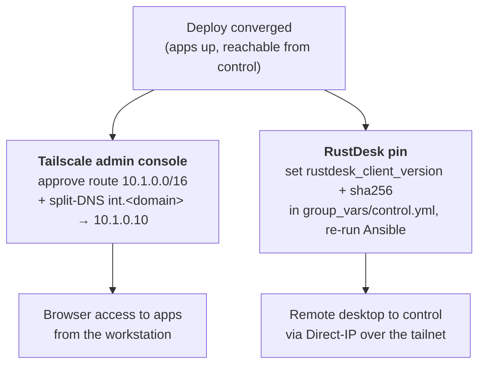

# Deploy and bootstrap lifecycle

This page describes how the lab moves from a bare Proxmox host to applications served over HTTPS in a single pass. It traces the mechanics of the flow — which tool produces which artifact, in what order, and where a stage can stall. For the operator walk-through with copy-paste commands, see the [Runbook](../RUNBOOK.md); for the full variable catalogue, the [Configuration reference](../CONFIGURATION.md).

The deploy is a relay. Each stage builds an artifact the next stage consumes, and no single tool drives the sequence end to end. Understanding the hand-offs is what makes a stalled run diagnosable: the point of failure names the stage, and the stage names the tool that owns it.

## The chain of custody

Five stages carry the lab from image build to running applications; a sixth captures the small set of steps that remain manual because they live outside the lab's control plane.

```mermaid
flowchart LR
    A["<b>Build templates</b><br/>on the Proxmox host<br/>(v2e-templates)"]
    B["<b>tofu apply</b><br/>on the workstation<br/>(v2e-tf)"]
    C["<b>cloud-init</b><br/>control's first boot"]
    D["<b>Ansible site.yml</b><br/>from control<br/>(v2e-ansible)"]
    E["<b>Stacks up</b><br/>Docker on<br/>services + infra"]
    F["<b>Manual post-deploy</b><br/>Tailscale console,<br/>RustDesk pin"]
    A -->|"qm templates<br/>9900-9903"| B
    B -->|"router + 4 nodes<br/>+ user-data snippets"| C
    C -->|"clone repo,<br/>run playbook"| D
    D -->|"6 phases"| E
    E -.->|"reachable,<br/>not yet browsable"| F
```



| Stage | Runs on | Tool | Artifact it produces |
|---|---|---|---|
| 1. Templates | Proxmox host | `virt-customize` + `qm` | one `qm template` per image (VMIDs `9900`–`9903`) |
| 2. `tofu apply` | operator workstation | OpenTofu + `bpg/proxmox` provider | VyOS router + 4 node VMs + cloud-init snippets |
| 3. cloud-init | `control` (first boot) | cloud-init | Ansible installed, repo cloned, secrets staged |
| 4. `site.yml` | `control` | Ansible | hardened nodes, Docker, rendered `.env` files |
| 5. Stacks | `services` + `infra` | Docker Compose (via `compose_stack`) | Traefik, TinyAuth, observability, DNS and relay containers |
| 6. Post-deploy | Tailscale console + `control` | manual | browser access + RustDesk |

The four templates are built on the Proxmox host by the `build-*.sh` scripts in v2e-templates, which drive `virt-customize` and `qm` directly — there is no Packer and no build network. Their VMIDs are defined in `v2e-templates/config.env`: VyOS (`9900`), Ubuntu 24.04 (`9901`), Debian 13 (`9902`) and Parrot Home (`9903`). These are the staging range; the production range is `9000`–`9003`. `network.tf` maps `control` to the Parrot desktop template, `services` to Ubuntu, and `agent` and `infra` to Debian.

!!! note "cloud-init runs once per VM"
    A change to a variable in `terraform.tfvars` never re-applies to a live VM; the VM must be recreated with `tofu apply -replace`. Ansible, by contrast, is re-runnable from `control` at any time. This split is deliberate: almost all *configuration* lives in Ansible, and only *provisioning* lives in cloud-init.

## Ordering inside `tofu apply`

The router must be routing before the nodes boot, or their first-boot `apt` step fails for want of a path to the internet. OpenTofu enforces this with an explicit wait rather than a dependency edge alone, in `v2e-tf/router.tf` and `v2e-tf/nodes.tf`:

- `proxmox_virtual_environment_vm.vyos` is created first.
- `time_sleep.router_ready` waits `router_boot_wait` (default `120s`, set in `v2e-tf/variables.tf`) for VyOS to boot and apply its routing and firewall.
- All four `proxmox_virtual_environment_vm.node[*]` `depends_on` that wait, so they begin cloning only once it elapses.

The router is configured entirely by its OpenTofu cloud-init template, `v2e-tf/cloud-init/vyos-router.yaml.tftpl` — the WAN and LAN interfaces, the VLAN gateways, source NAT for outbound traffic, the SSH DNAT (WAN `:2201` → `control` `:22`, from `control_ssh_wan_port`), and the default-deny firewall. VyOS is not touched by the unattended `site.yml`; its hardening is an on-demand operations playbook under `playbooks/ops/`. Firewall changes therefore mean editing the template and rebuilding the router with `-replace` — a live `set firewall` edit is wiped on the next rebuild.

!!! warning "A slow router boot fails the nodes' package stage"
    If a node's package stage fails on first boot, VyOS was not yet routing; raise `router_boot_wait`. Login still works, because users and keys are written before packages, so the node is reachable over SSH for inspection.

## Inside control's cloud-init

Only the `control` node receives the bootstrap logic. The three other nodes render the Ansible, SOPS and cloudflared blocks empty, byte-identical to a no-bootstrap node; this is gated in `v2e-tf/nodes.tf` on `k == "control"`. The bootstrap is driven from `runcmd` in `v2e-tf/cloud-init/node.yaml.tftpl`, in this order:

1. **Optional Cloudflare tunnel connector** — best-effort (`|| true`); a tunnel hiccup never fails the deploy, and the SSH DNAT already covers remote access.
2. **Install Ansible** for the `ansible` user via `pipx install --include-deps` (user-isolated under `~/.local`).
3. **Clone v2e-ansible** from `ansible_repo_url` at `ansible_repo_ref`, idempotently.
4. **Decrypt SOPS secrets** — when configured, `secrets.sops.yaml` is installed to `group_vars/all.sops.yaml` *and* decrypted to `~/.v2e-secrets.yml`.
5. **Install Galaxy dependencies** from `requirements.yml` (roles and collections).
6. **Wait for the mesh** — `ansible all:!vyos -m wait_for_connection`, best-effort. VyOS is excluded because its `vyos` login is the VyOS CLI, not a Python shell.
7. **Run the playbook** — `ansible-playbook -i inventory/hosts.ini site.yml`, with `-e @~/.v2e-secrets.yml` appended when SOPS is set.

!!! note "Why secrets are passed as `-e @file`, not group_vars alone"
    The `community.sops` vars plugin returns group_vars empty during the full multi-phase run, because `geerlingguy.docker`'s `meta: reset_connection` drops demand-mode vars. `compose_stack`'s secret assertions need values from a source resolved once and never re-derived, so cloud-init also decrypts the secrets to `~/.v2e-secrets.yml` and passes them as highest-precedence extra-vars.

The `control` node is the mesh hub. Its cloud-init drive carries the mesh SSH private key and `~/.ssh/config`, so the `ansible` user reaches `services`, `agent`, `infra` and the router by alias with no further credentials. Treat that VM's disk and snapshots as key material.

## Inside `site.yml` — the six phases

`site.yml` statically imports six phase playbooks in order. The `health_check` role in phase 01 is the fail-fast gate: if a node is unreachable or misconfigured, the run stops before anything is changed.



| Phase | Playbook | Hosts | Roles and effect |
|---|---|---|---|
| 01 | `01-bootstrap.yml` | `linux` (all 4 nodes) | ping smoke test → `health_check` (fail-fast) → `baseline` → `devsec.hardening` (os + ssh) → `fail2ban` |
| 02 | `02-services.yml` | `services` | `geerlingguy.docker` → `compose_stack` (Traefik, TinyAuth, whoami, Semaphore, Arcane, observability) |
| 03 | `03-applications.yml` | `agent` | `ai_identities` → `ai_workbench` (AI-agent accounts and workbench, on the `agent` node only) |
| 04 | `04-infra.yml` | `infra` | `geerlingguy.docker` → pin `resolv.conf` and free `:53` → `compose_stack` (Technitium, RustDesk relay) → `technitium_zone` (seed `int.<domain>` via API) |
| 05 | `05-tailscale.yml` | `control:infra` | `tailscale` — `control` becomes the subnet router for `10.1.0.0/16`; `infra` joins directly. Skips gracefully when `tailscale_authkey` is absent |
| 06 | `06-control-desktop.yml` | `control` | `control_desktop` (LightDM autologin, compositor off, resolver → Technitium) → `rustdesk_client` |

!!! note "The `:53` hand-off on infra is ordered for safety"
    In phase 04, `resolv.conf` is pinned to the upstream resolvers *first*, so the node's own name resolution never depends on the Technitium container it is about to run. Only then is the systemd-resolved stub listener disabled to free `:53`, and the stacks deployed. A container restart cannot take down the node's DNS.

!!! tip "Graceful skips keep the unattended run green"
    Phases 05 and 06 skip their not-yet-configured pieces — an empty `tailscale_authkey`, an unpinned `rustdesk_client_version` — with a warning rather than a failure. Set the value later and re-run Ansible to pick it up.

## Verifying convergence

Allow 10–20 minutes after `apply` finishes. Then, from `control`:

- `sudo cloud-init status --long` reports `done`.
- `sudo grep -A5 'PLAY RECAP' /var/log/cloud-init-output.log` shows `failed=0` on every host.
- `ssh services docker ps` shows all stacks `Up (healthy)`.
- `ssh services docker logs traefik | grep -i 'certificates obtained'` confirms the wildcard certificate was issued over DNS-01, with no inbound ports.

At this point the applications answer over HTTPS from *inside* the lab, but the internal name `int.<domain>` is not yet resolvable from the workstation — that is the manual step below. Confirm reachability with `curl --resolve <app>.int.<domain>:443:10.1.2.10`.

## What stays manual after convergence

Everything reproducible is codified. What remains is genuinely outside the lab's control plane: tailnet-side settings held in the Tailscale admin console, and one client-side release pin.



1. **Tailscale admin console** — once phase 05 has joined the tailnet with an auth key, approve `control`'s advertised route `10.1.0.0/16` and set split-DNS `int.<domain>` → `10.1.0.10` (Technitium, the `infra` node). That gives the workstation browser access to every application.
2. **RustDesk** — the client is already pinned in `inventory/group_vars/control.yml` (`rustdesk_client_version` plus the `.deb` sha256), so the `rustdesk_client` role installs it unattended; the skip-with-warning behaviour applies only if the pin is blanked. Connect over **Direct IP** to `control`'s tailnet address using `rustdesk_unattended_password`.
3. **Anything skipped for want of a secret** — for example an empty `tailscale_authkey` — is picked up by re-running Ansible from `control`:

    ```bash
    sudo -iu ansible bash -lc 'cd ~/ansible && \
      ansible-playbook -i inventory/hosts.ini site.yml -e @~/.v2e-secrets.yml'
    ```

!!! warning "macOS resolution caveats"
    If Tailscale split-DNS is unreliable, pin a native resolver:
    `echo 'nameserver 10.1.0.10' | sudo tee /etc/resolver/int.<domain>`. Note that Mullvad hijacks DNS while connected and breaks internal resolution.

## Rebuild versus re-converge

The boundary between the two tools follows directly from cloud-init running once and Ansible being re-runnable.

| Goal | Action |
|---|---|
| Change a node's cloud-init or provisioning | `tofu apply -replace='proxmox_virtual_environment_vm.node["<name>"]'` |
| Change the router or firewall | `tofu apply -replace='proxmox_virtual_environment_vm.vyos'` |
| Change Ansible-managed configuration | re-run `site.yml` from `control` (no rebuild) |
| Tear the lab down | `tofu destroy` (also removes the tunnel and CNAME) |

A `terraform.tfvars` edit that affects a live VM requires a `-replace`; everything Ansible owns is a re-run. That is the deliberate line between provisioning and configuration.

## Related

- [Architecture overview](architecture.md) — node roles, VMIDs and the topology this lifecycle produces.
- [Network, VLANs & firewall](networking.md) — the VyOS routing and DNAT the nodes depend on at first boot.
- [Secrets & SOPS flow](secrets.md) — how the age key and encrypted secrets reach `control` and the playbook.
- [Tailscale, exit nodes & DNS](tailscale-dns.md) — the tailnet join and split-DNS that finish remote access.
