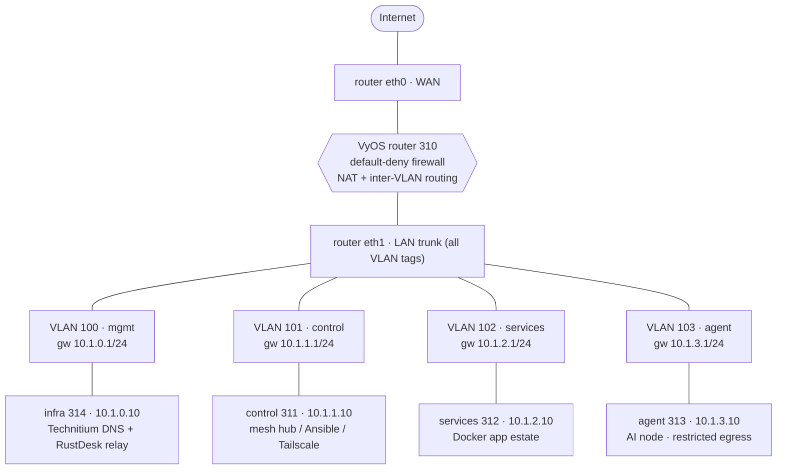
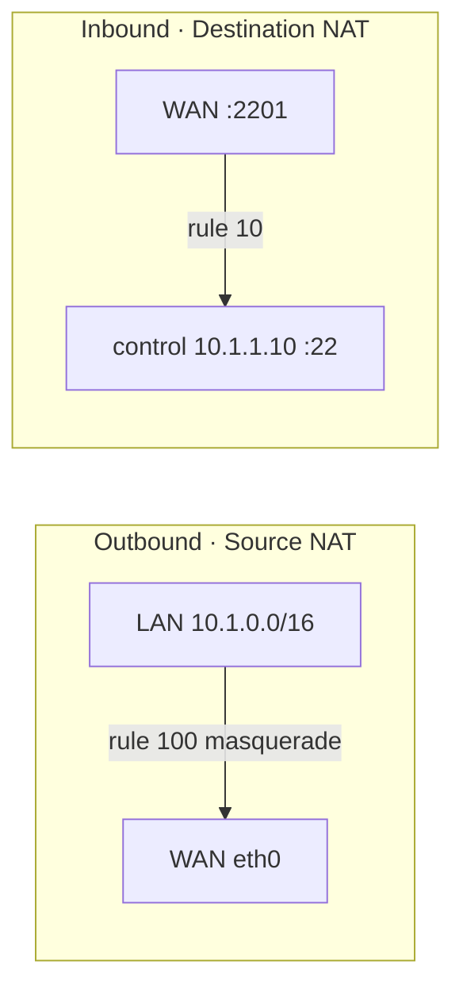
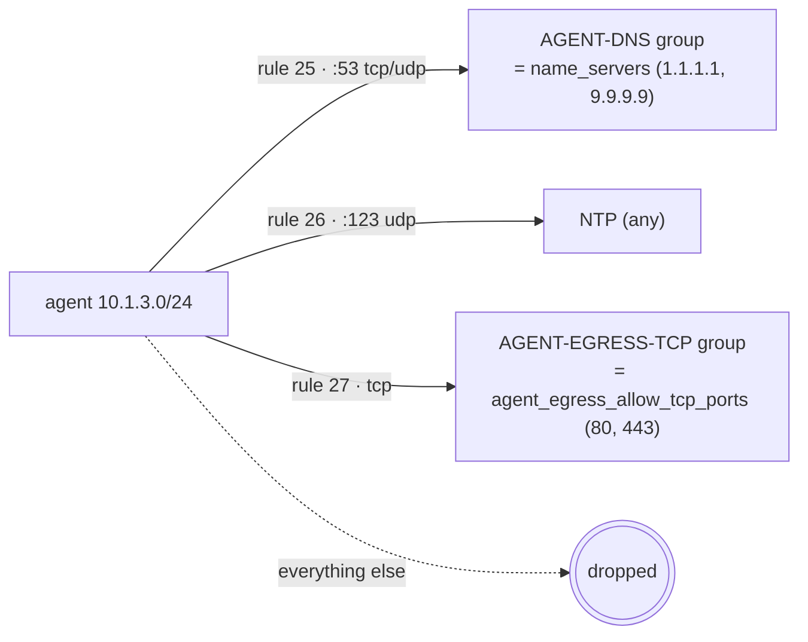

# Network, VLANs & firewall

The v2e lab is a **router-on-a-stick**: a single VyOS VM owns every gateway, sits
between the lab and the internet, and enforces a default-deny firewall that keeps
each node in its own VLAN. This page explains the segmentation, the NAT (DNAT in,
masquerade out), the per-VLAN forwarding policy, the agent-node egress allowlist,
and the emergency kill switch.

!!! note "Where this comes from"
    Topology and firewall are declared in Terraform and rendered into the router's
    cloud-init on first boot:
    `v2e-tf/network.tf` (topology model), `v2e-tf/router.tf` (VM + firewall inputs),
    `v2e-tf/cloud-init/vyos-router.yaml.tftpl` (the actual `set` commands).
    Day-2 router changes live in Ansible: `roles/vyos_hardening_basic`,
    `roles/killswitch`, `playbooks/ops/vyos-hardening.yml`,
    `playbooks/ops/killswitch.yml`.

## Topology at a glance

One VyOS VM (`router`, VMID 310), two NICs:

- **`eth0` → WAN** (`vmbr0`). Static CIDR or DHCP (`wan_address`); default route via
  `wan_gateway`.
- **`eth1` → LAN trunk** (`vmbr1`, no native VLAN — carries all tags). Each VLAN is a
  tagged sub-interface (`eth1.<vlan>`) whose address is the **gateway for that
  subnet**.



| VLAN | Name | Subnet | Gateway | Node | Egress |
|------|------|--------|---------|------|--------|
| 100 | mgmt (`vyos-mgmt`) | `10.1.0.0/24` | `10.1.0.1` | infra `10.1.0.10` | open |
| 101 | control | `10.1.1.0/24` | `10.1.1.1` | control `10.1.1.10` | open |
| 102 | services | `10.1.2.0/24` | `10.1.2.1` | services `10.1.2.10` | open |
| 103 | agent | `10.1.3.0/24` | `10.1.3.1` | agent `10.1.3.10` | **allowlist only** |

The subnet scheme is derived from `network_prefix` (`10.1`) and each subnet's
third-octet id — change one variable and the whole plan moves. The `mgmt` VLAN
carries no node of its own beyond `infra`, deliberately putting foundational
DNS/remote-access in their own failure domain, off the churny services node.

!!! note "Router first, then nodes"
    Terraform builds the router before the nodes and gates them on a
    `time_sleep.router_ready` (`router_boot_wait`, default `120s`) so VyOS has
    applied routing before any node tries to reach its gateway.

## NAT



- **Source NAT (masquerade).** Rule `100` masquerades the whole lab supernet
  (`lan_supernet`, `10.1.0.0/16`) out `eth0`. This is how every node reaches the
  internet behind the single WAN IP.
- **Destination NAT (port-forward).** Rule `10` forwards WAN TCP port
  `control_ssh_wan_port` (default **2201**) to `control:22` — the always-on SSH
  ingress to the mesh hub. It is the only port-forward defined by default.

## Firewall — default-deny isolation boundary

Applied only when `firewall_enabled = true` (the default). Two things make it
default-deny: a stateful global policy plus drop defaults on both the router's
own traffic (`input`) and routed traffic (`forward`).

```
state-policy established → accept
state-policy related     → accept
state-policy invalid     → drop
input   filter default-action → drop
forward filter default-action → drop
```

Everything else is an explicit allow. Lower rule numbers match first.

### `input` — traffic to the router itself

| Rule | Allow |
|------|-------|
| 5  | loopback |
| 10 | control VLAN (`eth1.101`) → router **SSH :22** |
| 20 | ICMP to the router **from the LAN supernet only** (the router does not answer WAN pings) |
| 30 | `trusted_mgmt_sources` (WAN CIDRs) → router SSH :22 — *only if that list is non-empty* |

!!! warning "WAN SSH to the router is off by default"
    `trusted_mgmt_sources` defaults to empty, so rule 30 is not created and there is
    **no WAN path to the router's own shell** — you manage it from `control`. This is
    independent of the control DNAT (2201), which is a forward, not an input, rule.

### `forward` — traffic routed between segments and to the internet

| Rule | From → To | Purpose |
|------|-----------|---------|
| 10 | WAN → control `:22` | let the DNAT'd SSH through |
| 20 | control → WAN | control internet egress (open) |
| 21 | services → WAN | services internet egress (open) |
| 25–27 | agent → WAN | **egress allowlist** (see below) — or one open `agent → internet` rule if unrestricted |
| 30 | control → services | management |
| 31 | control → agent | management (and the kill-switch recovery path) |
| 32 | control → infra | management |
| 33 | infra → WAN | infra image/update egress (open) |
| 34 | services → infra `:53` | resolve DNS against Technitium |
| 35 | agent → infra `:53` | resolve DNS against Technitium |

Because the default action is **drop**, anything not listed is denied. Notably:
services and agent cannot initiate to each other or to control; only `control`
reaches into the spokes. This is the property that isolates the AI agent and the
app estate from one another.

## Agent egress allowlist (zero-trust for the AI VLAN)

When `agent_egress_restricted = true` (the default), the agent node's internet
access is deny-by-default. Only three things leave the box:



- **DNS (rule 25)** — TCP/UDP `:53`, but only to the addresses in the `AGENT-DNS`
  address-group, which is exactly `name_servers`. The agent cannot use an arbitrary
  resolver.
- **NTP (rule 26)** — UDP `:123`.
- **Allowlisted TCP (rule 27)** — only destination ports in the `AGENT-EGRESS-TCP`
  port-group (`agent_egress_allow_tcp_ports`, default `80, 443` — enough for apt,
  git, container pulls, HTTPS APIs).

Set `agent_egress_restricted = false` to collapse this to a single open
`agent → internet` rule (like the other nodes). `control` and `services` always keep
open egress regardless.

!!! tip "Independent DNS path"
    The agent may query the internal Technitium resolver on `infra:53` (forward rule
    35) as well as the allowlisted upstream resolvers. Both are `:53`-scoped.

## Kill switch — cutting the agent off in an emergency

`roles/killswitch`, driven by `playbooks/ops/killswitch.yml`, is a router-enforced
emergency stop for the agent subnet. It applies **additive, removable** VyOS rules
(numbered from `killswitch_rule_base`, default `100/101/110`) so it composes with the
base firewall. Pick exactly one action by tag:

```bash
ansible-playbook playbooks/ops/killswitch.yml --tags cut       # surgical
ansible-playbook playbooks/ops/killswitch.yml --tags allow     # restore
ansible-playbook playbooks/ops/killswitch.yml --tags cut-hard  # blackout
```

| State | Effect |
|-------|--------|
| **cut** (surgical) | Drops all forwarded traffic sourced from the agent subnet (`10.1.3.0/24`) — WAN egress *and* inter-VLAN — while keeping `control (10.1.1.10) ↔ agent` alive so you can still SSH in to investigate. The drop is stateless on source, so it also tears down in-flight agent sessions (e.g. an open exfil channel). |
| **allow** | Removes the kill-switch rules and re-enables the VLAN interface, returning the agent to the base firewall. Tolerant of any prior state (safe to re-run). |
| **cut-hard** | Disables the agent VLAN sub-interface (`eth1` vif `103`) entirely. Total blackout — you also lose the control→agent recovery channel. `allow` brings it back. |

The playbook guards every play with a `never` tag, so a tagless run does **nothing**
— an explicit action tag is required. Nothing the switch does touches the router's
own input path from `control`, so a plain commit can't lock you out.

!!! warning "Operate it out-of-band"
    The kill switch is only as strong as the agents' inability to reach the router.
    AI accounts are rooted on `control`, which holds router-capable mesh keys, so
    prefer running the switch **out-of-band** (from the workstation / Proxmox
    console) rather than from a session the agent could influence.

## Router hardening

`roles/vyos_hardening_basic` (via `playbooks/ops/vyos-hardening.yml`, or
`site.yml --tags vyos`) applies a minimal, non-disruptive baseline over the existing
key-based session:

- `service ssh disable-password-authentication` — **key-only** login
- `client-keepalive-interval 180`, `disable-host-validation`, `loglevel info`
- `system config-management commit-confirm action reload` — makes confirmed-commit a
  reload, not a reboot, so later risky firewall changes can use commit-confirm safely
- a pre-login banner (`Authorized access only.`)

!!! warning "Key-only means key-or-lockout"
    This role turns off password SSH. The management mesh key must already be
    authorized on the router (Terraform seeds it). Keep the Proxmox serial console as
    out-of-band recovery.

### Router login bootstrap

The router boots with only the default `vyos` user, which Terraform authorizes for
both mesh public keys (`primary`/v2e and `ansible`). Both meshes therefore reach it
as `vyos@10.1.1.1` — the bootstrap path Ansible uses before it provisions dedicated
router users of its own. Terraform sets login and interfaces/firewall; it does **not**
manage the day-2 router users.
