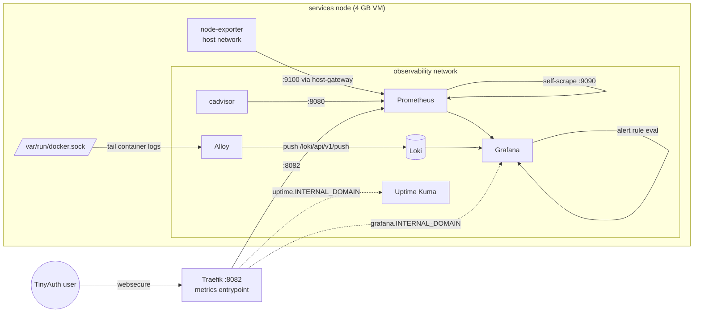
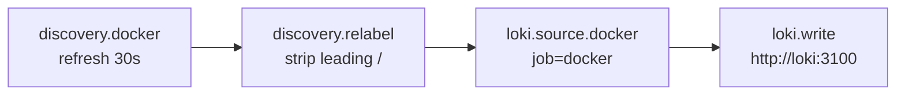
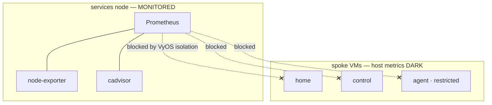

# Observability & alerting

The observability stack lives on the **services** node as a single Docker Compose
project (`v2e-compose/observability/`). It gives the lab three pillars — **metrics**
(Prometheus), **logs** (Loki), and **synthetic uptime checks** (Uptime Kuma) — all
visualised through **Grafana**. Two exporters (node-exporter, cadvisor) plus Traefik's
built-in metrics feed Prometheus; **Alloy** tails every container's logs into Loki.

!!! note "Design constraints"
    The services node is a **4 GB VM**, so every service is memory-capped and the
    project totals a hard ceiling of roughly **1.2 GiB**. Only Grafana and Uptime Kuma
    are exposed through Traefik (TinyAuth-gated); everything else is internal-only and
    reached through Grafana as a datasource proxy. Alertmanager and Dozzle are
    deliberately omitted — Grafana unified alerting and Kuma's own notifications cover
    alerting, and Arcane covers live container logs.

## Components at a glance

| Service | Image | Role | mem_limit | Exposed via Traefik |
|---|---|---|---|---|
| Prometheus | `prom/prometheus:v3.13.0` | Metrics store + rule eval | 288m | No (proxied by Grafana) |
| Grafana | `grafana/grafana:13.0.3` | Dashboards + unified alerting | 240m | `grafana.${INTERNAL_DOMAIN}` |
| Loki | `grafana/loki:3.7.3` | Log store (single-binary) | 192m | No |
| Alloy | `grafana/alloy:v1.17.1` | Docker log shipper → Loki | 120m | No |
| Uptime Kuma | `louislam/uptime-kuma:2.4.0-slim` | Synthetic uptime probes | 140m | `uptime.${INTERNAL_DOMAIN}` |
| node-exporter | `prom/node-exporter:v1.11.1` | Host metrics | 24m | No (host network) |
| cadvisor | `ghcr.io/google/cadvisor:v0.60.3` | Per-container metrics | 200m | No |

!!! tip "Version pinning"
    Every image is pinned to an exact tag (never `latest`), consistent with the lab's
    dependency policy — Renovate proposes bumps rather than tags floating.

## Architecture



The stack joins two Docker networks: an internal `observability` network for
component-to-component traffic, and the external `frontend` network so Prometheus can
reach `traefik:8082` and so Grafana/Kuma can be published by Traefik. node-exporter is
special — it runs with `network_mode: host` and `pid: host` (mounting `/` read-only at
`/host`) to see real host metrics, and Prometheus reaches it back over
`host.docker.internal:9100` via an `extra_hosts` host-gateway mapping.

## Metrics — what Prometheus scrapes

Prometheus config (`config/prometheus.yml`) keeps a deliberately **minimal** scrape set,
all on the services node:

| Job | Target | What it covers |
|---|---|---|
| `prometheus` | `localhost:9090` | Prometheus self-metrics |
| `node` | `host.docker.internal:9100` | Host CPU / memory / disk / network |
| `cadvisor` | `cadvisor:8080` | Per-container resource usage |
| `traefik` | `traefik:8082` | Reverse-proxy request/latency metrics |

- **Scrape interval:** 30s · **rule evaluation:** 60s (globals).
- **Retention** is set in the config file, not flags — Prometheus v3 deprecated the
  `--storage.tsdb.retention.*` flags. Retention is **15 days or 1 GB**, whichever
  comes first.
- Prometheus v3 **auto-tunes `GOMEMLIMIT`** to ~0.9× its container `mem_limit`, so no
  explicit Go memory env is needed (unlike Loki/Alloy below).

Traefik exposes Prometheus metrics on a **dedicated `:8082` entrypoint** that is
container-internal only (never published to the host):

```
--entryPoints.metrics.address=:8082
--metrics.prometheus=true
--metrics.prometheus.entryPoint=metrics
```

## Logs — Alloy → Loki

**Alloy** (promtail's successor — promtail reached EOL in 2026-03) discovers every
running Docker container via the socket and ships its logs to Loki. The pipeline
(`config/config.alloy`) is intentionally simple:



- A relabel rule strips Docker's leading `/` from container names and writes the result
  to **both** `container` and `service_name` labels (`service_name` is what Grafana's
  Logs Drilldown expects). All lines also carry `job="docker"`.
- Loki (`config/loki.yaml`) runs **single-binary** with filesystem storage, schema
  **v13 + tsdb** (required by Loki 3.x, which defaults `allow_structured_metadata=true`
  and refuses older schemas), and **14-day retention** enforced by the compactor
  (`retention_enabled: true`).
- **Memory:** Loki and Alloy do *not* auto-tune to the cgroup limit, so each pins
  `GOMEMLIMIT` explicitly (Loki 160 MiB, Alloy 100 MiB) to force Go GC before the OOM
  killer fires.

!!! warning "Logs are shipped raw — no scrubbing pipeline"
    Alloy forwards container stdout/stderr **verbatim**; there is no relabel/redaction
    stage that masks secrets or PII before write. Anything an application logs (tokens,
    query strings, credentials in error traces) lands in Loki as-is. Treat Loki as
    sensitive, and prefer scrubbing at the *source* application until a redaction stage
    is added to the Alloy config.

## Uptime Kuma

Uptime Kuma runs synthetic probes and is published at `uptime.${INTERNAL_DOMAIN}`
(TinyAuth-gated, `websecure` entrypoint, TLS on). Its healthcheck uses the upstream
image's own Go probe (`extra/healthcheck`) against its local `:3001` app, with a 60 s
`start_period`. Kuma keeps its own notification integrations independent of Grafana —
it is the second, self-contained alerting path in the stack.

## Alerting — current state

Grafana ships **one provisioned alert rule** via
`config/grafana-alerting.yaml` (folder/group `v2e`):

| Field | Value |
|---|---|
| Rule | **Scrape target down** (`uid: target-down`) |
| Query | `count(up == 0) or vector(0)` (instant, last 5 min) |
| Condition | value `> 0` (i.e. any target down) |
| `for` | 5m |
| noData / execErr | `OK` / `Error` |
| Summary | `{{ $values.A.Value }} Prometheus scrape target(s) down` |

The `or vector(0)` keeps the series alive (reporting zero) when everything is up, so the
rule always has data to evaluate.

!!! warning "Known gap — no delivery channel wired"
    This rule **evaluates but has no contact point / notification policy**. Nothing is
    emailed, pushed, or webhooked when it fires — you must open a Grafana instance to
    see the alert state. Wiring a notification channel (email/webhook) in the Grafana UI
    is a deliberate, still-open TODO. The rule itself needs no channel to *evaluate*.

    The broader **Phase G alerting rules** (per-condition rules such as cert-expiry,
    DNS-resolver health, disk-full, memory-pressure) are **planned but not yet on
    `main`** — only the single scrape-target-down acceptance rule is deployed today.
    Do not assume cert/DNS/disk/mem alerts are live.

!!! info "In flight — PR #16"
    A `blackbox-exporter` + cert/DNS/disk/memory alert-rules pack **and** Alloy log
    scrubbing are authored on the `feat/alerting-and-log-scrubbing` branch (v2e-compose
    PR #16), not yet merged. Notification delivery (an Apprise/ntfy contact point) is a
    follow-up once the channel is chosen. This page describes the deployed `main` state.

## Known gap — cross-node host metrics

Prometheus runs on **services** and today monitors the **services host and all of its
containers** (node-exporter + cadvisor + Traefik/app metrics). It **cannot** scrape
node-exporter on the isolated spoke VMs — the VyOS firewall isolates spokes by design,
so other VMs' host metrics are currently dark.



Per HANDOVER, the recommended fix is to **scrape over the tailnet** — run node-exporter
on `home` + `control` (already on the tailnet), put services on the tailnet too, and
scrape their `100.x` addresses, avoiding new VLAN/firewall holes. The alternative
(narrowing VyOS rules `services → {home,agent,control}:9100`) needs a router rebuild and
widens the security boundary, so it is not preferred. `agent` is lowest priority (it is
the restricted AI node).

## Access & secrets

- **Grafana** login is `admin` with `GF_SECURITY_ADMIN_PASSWORD` sourced from the
  SOPS-rendered `.env` (`grafana_admin_password`) — sign-up disabled, analytics and
  update checks off. Root URL is `https://grafana.${INTERNAL_DOMAIN}/`.
- All persisted state uses **named volumes** (`prometheus-data`, `grafana-data`,
  `loki-data`, `alloy-data`, `kuma-data`) rather than bind mounts, because the images
  run as non-root uids (grafana 472, prometheus 65534, loki 10001) that cannot write
  root-owned host dirs.
- Both published routes attach the `auth@docker` (TinyAuth) and `secure-headers@docker`
  middlewares.

!!! note "Backup"
    Grafana and Uptime Kuma volumes are named in the pending backup/DR plan (pg_dump +
    tar of lab state pushed to TrueNAS). That work is not yet automated — see HANDOVER
    item **H**.
