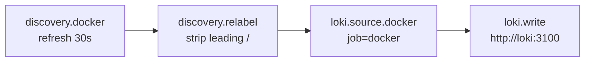
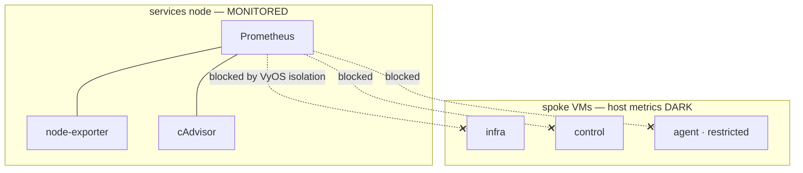

# Observability and alerting

The lab's observability stack gives operators three signals — metrics, logs, and
synthetic uptime checks — behind a single Grafana pane. It runs on the `services` node
as one Docker Compose project (`v2e-compose/observability/`) and is sized to fit inside
that node's constrained memory budget.

Prometheus stores metrics, Loki stores logs, and Uptime Kuma runs external probes;
Grafana visualises all three and evaluates alert rules. Two exporters (node-exporter,
cAdvisor) plus Traefik's built-in metrics feed Prometheus, while Alloy tails every
container's logs into Loki. Only Grafana and Uptime Kuma are published through Traefik;
every other component is internal-only and reached through Grafana as a datasource
proxy.

!!! note "Sizing and scope"
    The `services` node is a 4 GB VM, so every service carries an explicit `mem_limit`
    and the project totals roughly 1.2 GiB. Alertmanager and Dozzle are deliberately
    omitted: Grafana unified alerting and Uptime Kuma's own notifications cover alerting,
    and Arcane covers live container logs.

## Components at a glance

Every image is pinned to an exact tag (never `latest`), consistent with the lab's
dependency policy — Renovate proposes bumps rather than letting tags float. Images and
limits below are defined in `v2e-compose/observability/compose.yml`.

| Service | Image | Role | `mem_limit` | Exposed via Traefik |
|---|---|---|---|---|
| Prometheus | `prom/prometheus:v3.13.0` | Metrics store and rule source | `288m` | No (proxied by Grafana) |
| Grafana | `grafana/grafana:13.0.3` | Dashboards and unified alerting | `240m` | `grafana.${INTERNAL_DOMAIN}` |
| Loki | `grafana/loki:3.7.3` | Log store (single-binary) | `192m` | No |
| Alloy | `grafana/alloy:v1.17.1` | Docker log shipper to Loki | `120m` | No |
| Uptime Kuma | `louislam/uptime-kuma:2.4.0-slim` | Synthetic uptime probes | `140m` | `uptime.${INTERNAL_DOMAIN}` |
| node-exporter | `prom/node-exporter:v1.11.1` | Host metrics | `24m` | No (host network) |
| cAdvisor | `ghcr.io/google/cadvisor:v0.60.3` | Per-container metrics | `200m` | No |

## Architecture


The stack joins two Docker networks: an internal `observability` network for
component-to-component traffic, and the external `frontend` network so that Prometheus
can reach `traefik:8082` and so that Grafana and Uptime Kuma can be published by Traefik.
node-exporter is the exception — it runs with `network_mode: host` and `pid: host`,
mounting `/` read-only at `/host`, so that it observes real host metrics. Prometheus
reaches it back over `host.docker.internal:9100` through an `extra_hosts` host-gateway
mapping.

## Metrics

Prometheus keeps a deliberately minimal scrape set, all targets on the `services` node.
The jobs are defined in `config/prometheus.yml`.

| Job | Target | Coverage |
|---|---|---|
| `prometheus` | `localhost:9090` | Prometheus self-metrics |
| `node` | `host.docker.internal:9100` | Host CPU, memory, disk, network |
| `cadvisor` | `cadvisor:8080` | Per-container resource usage |
| `traefik` | `traefik:8082` | Reverse-proxy request and latency metrics |

The scrape interval is 30s and rule evaluation runs every 60s. Retention is configured
in the file rather than on the command line — Prometheus v3 deprecated the
`--storage.tsdb.retention.*` flags — and is set to 15 days or 1 GB, whichever comes
first. Prometheus v3 auto-tunes `GOMEMLIMIT` to roughly 0.9× its container `mem_limit`,
so no explicit Go memory variable is needed for it (unlike Loki and Alloy below).

Traefik exposes its Prometheus metrics on a dedicated `:8082` entrypoint that stays
container-internal and is never published to the host:

```
--entryPoints.metrics.address=:8082
--metrics.prometheus=true
--metrics.prometheus.entryPoint=metrics
```

## Logs

Alloy — the successor to promtail, which reached end of life in March 2026 — discovers
every running Docker container through the socket and ships its logs to Loki. The
pipeline in `config/config.alloy` is intentionally simple.



A relabel rule strips Docker's leading `/` from container names and writes the result to
both the `container` and `service_name` labels; `service_name` is the label Grafana's
Logs Drilldown expects. Every line also carries `job="docker"`.

Loki (`config/loki.yaml`) runs as a single binary with filesystem storage and schema
v13 on tsdb. That schema is required: Loki 3.x defaults `allow_structured_metadata=true`
and refuses older schemas. Retention is 14 days, enforced by the compactor with
`retention_enabled: true`. Neither Loki nor Alloy auto-tunes to its cgroup limit, so each
pins `GOMEMLIMIT` explicitly — 160 MiB for Loki, 100 MiB for Alloy — to force Go garbage
collection before the OOM killer fires.

!!! warning "Logs are shipped raw"
    Alloy forwards container stdout and stderr verbatim; no relabel or redaction stage
    masks secrets or PII before write. Anything an application logs — tokens, query
    strings, credentials in error traces — lands in Loki as-is. Treat Loki as sensitive
    and scrub at the source application.

## Uptime Kuma

Uptime Kuma runs synthetic probes and is published at `uptime.${INTERNAL_DOMAIN}`
(TinyAuth-gated, `websecure` entrypoint, TLS on). Its healthcheck uses the upstream
image's own Go probe (`extra/healthcheck`) against the local `:3001` app, with a 60s
`start_period`. Uptime Kuma keeps its notification integrations independent of Grafana,
providing a second, self-contained alerting path.

## Alerting

Grafana ships one provisioned alert rule via `config/grafana-alerting.yaml`, in the
folder and group `v2e`. It fires when any Prometheus scrape target has been down for
five minutes.

| Field | Value |
|---|---|
| Rule | Scrape target down (`uid: target-down`) |
| Query (`A`) | `count(up == 0) or vector(0)` (instant, last 5 min) |
| Condition (`C`) | threshold, value `> 0` (any target down) |
| `for` | 5m |
| noData / execErr | `OK` / `Error` |
| Summary | `{{ $values.A.Value }} Prometheus scrape target(s) down` |

The `or vector(0)` term keeps the series alive, reporting zero when everything is up, so
the rule always has data to evaluate.

!!! warning "No delivery channel is wired"
    This rule evaluates but has no contact point or notification policy. Nothing is
    emailed, pushed, or webhooked when it fires — an operator must open Grafana to see
    the alert state. Wiring a notification channel is done in the Grafana UI; the rule
    itself needs no channel to evaluate.

## Cross-node host metrics

Prometheus runs on the `services` node and monitors that host and all of its containers
through node-exporter, cAdvisor, and the Traefik and application metrics. It cannot
scrape node-exporter on the other spoke VMs: the VyOS firewall isolates spokes by
design, so host metrics for `infra`, `control`, and `agent` are dark.



Extending coverage over the tailnet — running node-exporter on the already-enrolled
nodes and scraping their `100.x` addresses — avoids opening new VLAN or firewall holes,
whereas narrowing the VyOS rules to permit `services → {infra,agent,control}:9100` widens
the security boundary. The `agent` node is the restricted AI host and is the lowest
priority to add.

## Access and state

Grafana signs in as `admin` with `GF_SECURITY_ADMIN_PASSWORD` sourced from the
SOPS-rendered `.env` (`grafana_admin_password`); sign-up, analytics, and update checks
are disabled, and the root URL is `https://grafana.${INTERNAL_DOMAIN}/`. Grafana
provisions two datasources from `config/grafana-datasources.yaml` — Prometheus (default)
and Loki — both in `proxy` access mode, which is why neither backend needs its own
Traefik route.

Both published routes attach the `auth@docker` (TinyAuth) and `secure-headers@docker`
middlewares. All persisted state uses named volumes (`prometheus-data`, `grafana-data`,
`loki-data`, `alloy-data`, `kuma-data`) rather than bind mounts, because the images run
as non-root uids — grafana `472`, prometheus `65534`, loki `10001` — that cannot write
root-owned host directories.

## Related

- [Application estate](applications.md) — the app stacks whose containers Alloy tails and Uptime Kuma probes
- [Network, VLANs & firewall](networking.md) — the VyOS isolation that bounds cross-node scraping
- [Secrets & SOPS flow](secrets.md) — how the Grafana admin password is rendered from SOPS
- [Tailscale, exit nodes & DNS](tailscale-dns.md) — the tailnet path referenced for future cross-node metrics
