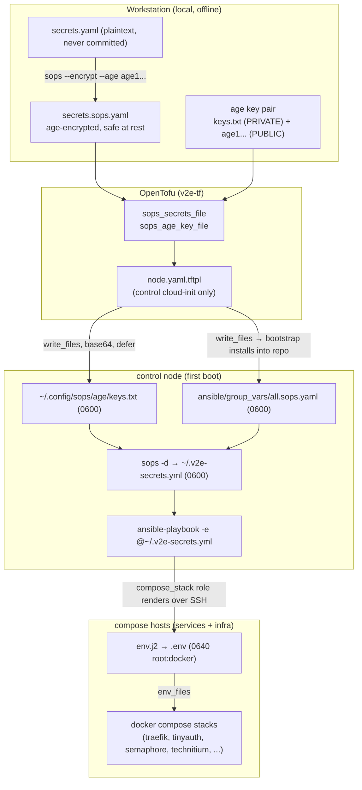

# Secrets and the SOPS flow

Every application secret in the estate travels a single, deliberately narrow path: a locally
encrypted file becomes live environment variables inside the Docker Compose stacks, decrypted only
on the control node. This page traces that chain end to end, states what belongs in SOPS versus
OpenTofu inputs, explains the `$$`-escaping convention that keeps `$`-bearing secrets intact, and
sets out the file modes and residual exposure that operators must account for.

The mechanism has two encryption boundaries. Secrets are encrypted at rest with [age](https://age-encryption.org)
via [SOPS](https://github.com/getsops/sops), and the age private key that unlocks them lives on
exactly one host — the control node — so no other node can read a secret even if compromised.

!!! note "SOPS shipping is optional and all-or-nothing"
    SOPS delivery is active only when **both** `sops_secrets_file` and `sops_age_key_file` are set
    in `terraform.tfvars`. A `check` block in `nodes.tf` (`sops_vars_consistent`) warns on a
    half-configured pair — one set, the other blank — but does not block `plan`. With both blank the
    nodes converge with no SOPS secrets, and any stack that needs them fails closed through its own
    Ansible assert. All values shown below are redacted.

## The chain at a glance



The flow proceeds in six steps.

1. **Local: generate and encrypt.** `age-keygen -o keys.txt` produces a private key and its
   `age1...` public recipient. The operator writes a flat `secrets.yaml`, then encrypts it to
   `secrets.sops.yaml`. The SOPS creation rule in `v2e-compose/.sops.yaml` binds the encryption:
   its `path_regex` is `secrets\.sops\.ya?ml$` and its `age` field carries the public recipient, so
   `sops` picks the right key automatically. The plaintext never leaves the workstation; only the
   encrypted file and the public key are safe to keep.
2. **OpenTofu: reference the files.** `terraform.tfvars` points `sops_secrets_file` at the encrypted
   file and `sops_age_key_file` at the **private** age key. In `nodes.tf` both are read with `file()`
   and injected into cloud-init **only** for the control node — the `k == "control"` guard
   short-circuits the `file()` call for every other node, so they never receive either value.
3. **cloud-init: land the files on control.** `cloud-init/node.yaml.tftpl` writes both via
   `write_files`, base64-encoded, `defer: true` (written after the `ansible` user exists), each at
   mode `0600`:
     - the age private key at `~ansible/.config/sops/age/keys.txt`, where SOPS auto-discovers it;
     - the encrypted secrets staged at `~ansible/secrets.sops.yaml`.
4. **control: install and decrypt.** The cloud-init `runcmd` bootstrap clones the Ansible repo, then
   `install`s the staged file into `group_vars/all.sops.yaml` **and** runs
   `sops -d ~/secrets.sops.yaml > ~/.v2e-secrets.yml` (mode `0600`), passing that file to
   `ansible-playbook` as `-e @$HOME/.v2e-secrets.yml`.
5. **Ansible: render `env.j2` to `.env`.** The `compose_stack` role first asserts that every entry
   in `compose_stack_required_secrets` is present and non-empty, then templates the secrets and
   non-secret config into `<stack_dir>/.env` at mode `0640 root:docker` with `no_log: true`.
6. **Stacks: consume via `env_files`.** Each `docker compose` stack loads the shared `.env`, turning
   each secret into a container environment variable.

!!! warning "The `.sops.yaml` extension is mandatory"
    The `community.sops` vars plugin auto-decrypts only files named `*.sops.yaml`, `*.sops.yml`, or
    `*.sops.json`. A file named `all.yml` is loaded as **raw ciphertext** — a silent failure that
    hands services garbage. This is why the bootstrap installs the staged file as
    `group_vars/all.sops.yaml`, and why the cloud-init comment forbids renaming it.

!!! note "Why the secrets are resolved twice"
    In the full multi-phase run, `geerlingguy.docker`'s `meta: reset_connection` drops demand-mode
    variables, so the `community.sops` group_vars plugin can return the secrets empty by the time
    `compose_stack` runs. The extra-vars file (`~/.v2e-secrets.yml`) is resolved **once** at
    bootstrap and never re-derived, and extra-vars are highest precedence, so it is the authoritative
    source the `compose_stack` assert relies on.

## The `$$`-escaping convention

`docker compose` performs variable interpolation on the **values** inside an env-file. A literal
value containing `$` — a bcrypt hash such as `$2a$10$...`, or any random token — is mangled: compose
reads `$2a` + `$10` + an empty expansion of an unset variable, silently corrupting the secret. The
canonical symptom is a TinyAuth login that never succeeds.

The fix lives in `roles/compose_stack/templates/env.j2`: every secret passes through
`| replace('$', '$$')` so compose restores a single literal `$`.

```jinja
CF_DNS_API_TOKEN={{ cf_dns_api_token | default('') | replace('$', '$$') }}
TINYAUTH_AUTH_USERS={{ tinyauth_auth_users | default('') | replace('$', '$$') }}
```

Two further `env.j2` conventions matter:

- **`default('')` on every secret** keeps the shared template rendering when a stack (semaphore,
  arcane, technitium, mullvad-exit) is not enabled on a given host. The template renders on every
  compose host; each stack's own compose guards its required values with `${VAR:?}` at deploy time,
  so an empty value fails that one stack loudly rather than the whole render.
- **Keys are lowercase in SOPS, `UPPER_CASE` in `.env`.** The Ansible assert checks the exact
  lowercase names; `env.j2` maps them to the compose-side `UPPER_CASE` variables.

!!! warning "Any new secret needs the escape"
    When a secret is added to `env.j2`, apply `| replace('$', '$$')`. Non-secret list-like values
    that never contain `$` — for example `NAME_SERVERS`, `MULLVAD_SERVER_CITIES`,
    `MULLVAD_SERVER_COUNTRIES` — intentionally omit it.

## What lives where: SOPS versus OpenTofu inputs

The split is by consumer. **SOPS** carries application secrets that ride to control and end up in a
stack's `.env`. **OpenTofu inputs** (`terraform.tfvars`) carry the infrastructure values needed to
build the VMs, plus the two pointers that enable SOPS. The lowercase SOPS keys below are exactly
those consumed in `env.j2`.

| In `secrets.sops.yaml` (age-encrypted, lowercase keys) | In `terraform.tfvars` (OpenTofu inputs) |
|---|---|
| `cf_dns_api_token` (Traefik ACME DNS-01) | `sops_secrets_file`, `sops_age_key_file` (the two pointers) |
| `tinyauth_auth_users` | `ansible_vault_password` (control only; intended to be superseded by SOPS) |
| `semaphore_db_pass`, `semaphore_admin_password`, `semaphore_access_key_encryption`, `semaphore_runner_reg_token` | `root_password` / node passwords |
| `arcane_encryption_key`, `arcane_jwt_secret` | `cloudflare_api_token` + account / zone IDs (tunnel) |
| `grafana_admin_password` | Proxmox connection, node sizing, and networking inputs |
| `technitium_admin_password` | |
| `mullvad_wireguard_private_key`, `mullvad_wireguard_addresses` | |
| `tailscale_authkey` (use a **reusable**, not ephemeral, key) | |

The per-host `compose_stack_required_secrets` list drives which keys the Ansible assert enforces: the
services node requires `cf_dns_api_token` and `tinyauth_auth_users`; the infra node requires
`technitium_admin_password`, `mullvad_wireguard_private_key`, `mullvad_wireguard_addresses`, and
`tailscale_authkey`.

!!! info "Mesh SSH keys are generated, not supplied"
    The two SSH trust meshes (`v2e` and `ansible`) are ED25519 keypairs generated by
    `tls_private_key` resources in `keys.tf`. They are not tfvars inputs, but they do end up in
    OpenTofu state, and the hub (control) private keys are written into control's cloud-init.

!!! note "Encrypt to two age recipients"
    Encrypt `secrets.sops.yaml` to control's public key **and** an offline backup key
    (`--age "<pub1>,<pub2>"`). Under SOPS a lost private key loses every secret.

!!! note "Arcane's first-boot login is not in SOPS"
    Arcane seeds `admin` / `password` on first boot; change it in the UI immediately. Seeded Arcane
    credentials are not yet codified in the secret store.

## File permissions and modes

| File | Owner / mode | Notes |
|---|---|---|
| `~ansible/.config/sops/age/keys.txt` | `ansible`, `0600` | age private key; SOPS auto-discovers it |
| `~ansible/secrets.sops.yaml` (staged) → `group_vars/all.sops.yaml` | `ansible`, `0600` | encrypted at rest |
| `~ansible/.v2e-secrets.yml` | `ansible`, `0600` | decrypted extra-vars, control node only |
| `<stack_dir>/.env` | `root:docker`, `0640` | rendered with `no_log: true`; docker-group is root-equivalent |
| `traefik/data/acme.json` | `0600` | runtime data dir, excluded from the tree-wide chmod |

The `compose_stack` role makes the public git tree group- and other-readable so non-root container
UIDs (grafana 472, loki 10001, prometheus 65534) can read their bind-mounted configs at first start.
It prunes `*/data` directories from that chmod, so the plaintext `.env` and Traefik's `acme.json`
keep their tight modes.

## Residual exposure

Secrets currently transit two plaintext intermediaries that operators must treat as sensitive.

!!! warning "State and cloud-init carry the age key"
    - **OpenTofu state is plaintext.** It contains the generated mesh SSH private keys, the
      Cloudflare token, and — because `file(var.sops_age_key_file)` is read at plan time — the age
      private key. State is gitignored, but any copy is a full compromise. Encrypting state (for
      example `TF_ENCRYPTION`) removes this exposure; until then, treat `.tfstate*` as key material.
    - **Control's cloud-init user-data embeds the age key** (base64-encoded, not encrypted), the same
      way it embeds the hub mesh private keys. Treat any snapshot of that user-data as sensitive.

The intended end state is to rotate all secrets and the age key on a clean rebuild, encrypt OpenTofu
state so the key never sits in plaintext, and lean on SOPS as the single secret store — superseding
`ansible_vault_password`.

## Related

- [Deploy & bootstrap lifecycle](lifecycle.md) — where cloud-init runs the Ansible bootstrap
- [Network, VLANs & firewall](networking.md) — node placement and the isolation SOPS relies on
- [Application estate](applications.md) — the stacks that consume these secrets
- [Tailscale, exit nodes & DNS](tailscale-dns.md) — the Mullvad exit and Tailscale key usage
