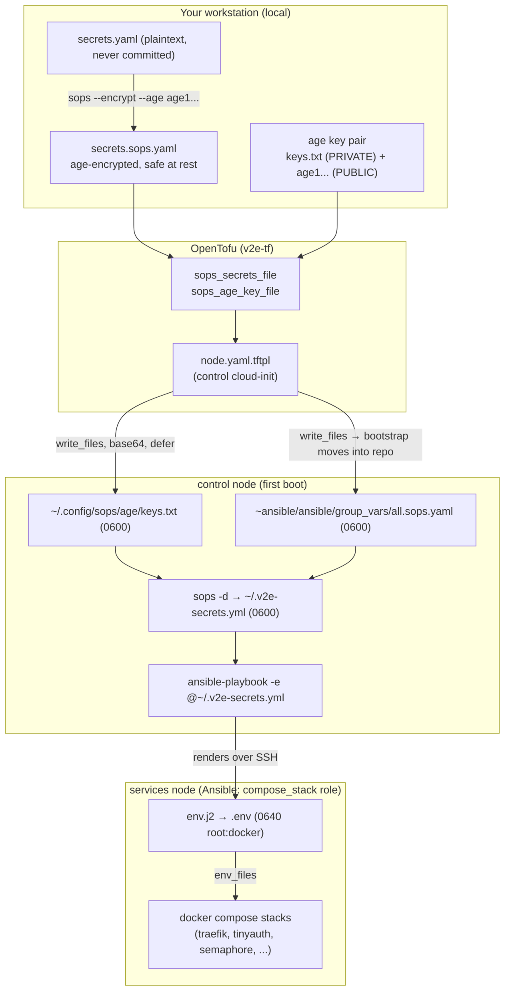

# Secrets & SOPS flow

How a single, locally-encrypted secrets file becomes live environment variables inside the
Docker stacks — and why that path is deliberately narrow. This page traces the whole chain,
explains the `$$`-escaping gotcha, states what belongs in SOPS versus OpenTofu `tfvars`, and
notes the planned hardening.

!!! note "Feature is optional and all-or-nothing"
    SOPS shipping is off unless **both** `sops_secrets_file` and `sops_age_key_file` are set in
    `terraform.tfvars`. OpenTofu asserts that you set both or neither — a half-configured pair
    fails `plan`. With both blank, nodes converge with no SOPS secrets (stacks that require them
    fail closed via their asserts). All values below are redacted.

## The chain at a glance



Step by step:

1. **Local: generate + encrypt.** `age-keygen -o keys.txt` produces a private key and its
   `age1...` public recipient. You write a flat `secrets.yaml`, then
   `sops --encrypt --age <public-key> secrets.yaml > secrets.sops.yaml`. The plaintext never
   leaves your machine; only the encrypted file and the public key are safe to keep around.
2. **OpenTofu: reference the files.** `terraform.tfvars` points `sops_secrets_file` at the
   encrypted file and `sops_age_key_file` at the **private** age key. Both are read with
   `file()` and injected **only** into the control node's cloud-init (`k == "control"` guard in
   `nodes.tf`) — the other nodes never see them.
3. **cloud-init: land the files on control.** `node.yaml.tftpl` `write_files` both, base64-encoded,
   `defer: true` (written after the `ansible` user exists), each at mode `0600`:
    - the age private key → `~ansible/.config/sops/age/keys.txt` (SOPS auto-discovers it here);
    - the encrypted secrets → `~ansible/secrets.sops.yaml`, staged in the home dir.
4. **control: decrypt + run Ansible.** The cloud-init `runcmd` bootstrap clones the Ansible repo,
   then `install`s the staged file into `group_vars/all.sops.yaml` **and** runs
   `sops -d ~/secrets.sops.yaml > ~/.v2e-secrets.yml` (0600), passing it to `ansible-playbook` as
   `-e @$HOME/.v2e-secrets.yml`.
5. **Ansible: render `env.j2` → `.env`.** The `compose_stack` role templates the secrets (plus
   non-secret config) into `<stack_dir>/.env` at mode `0640 root:docker`, with `no_log: true`.
6. **Stacks: consume via `env_files`.** Each `docker compose` stack loads that shared `.env`, so
   the secret becomes a container environment variable.

!!! warning "Why the extension `.sops.yaml` is mandatory"
    The `community.sops` vars plugin only auto-decrypts files named `*.sops.yaml` / `.yml` / `.json`.
    A file named `all.yml` is loaded as **raw ciphertext** — a silent failure that hands services
    garbage. The cloud-init comment calls this out explicitly; do not rename it.

!!! note "Why decrypt twice (group_vars *and* `-e @file`)"
    In the full multi-phase run, `geerlingguy.docker`'s `meta: reset_connection` drops demand-mode
    vars, so the `community.sops` group_vars plugin can return the secrets empty by the time
    `compose_stack` runs. The extra-vars file is resolved **once** at bootstrap and never
    re-derived, so it is the authoritative source the `compose_stack` SOPS assert relies on.
    Extra-vars are also highest precedence.

## The `$$`-escaping gotcha

`docker compose` performs variable interpolation on the **values** inside an env-file. A literal
value containing `$` — a bcrypt hash like `$2a$10$...`, or any random token — is mangled: compose
reads `$2a` + `$10` + an empty expansion of an unset variable, silently corrupting the secret (the
canonical symptom is TinyAuth logins that never succeed).

The fix lives in `roles/compose_stack/templates/env.j2`: every secret is passed through
`| replace('$', '$$')` so compose restores a single literal `$`:

```jinja
CF_DNS_API_TOKEN={{ cf_dns_api_token | default('') | replace('$', '$$') }}
TINYAUTH_AUTH_USERS={{ tinyauth_auth_users | default('') | replace('$', '$$') }}
```

!!! warning "Any new secret with a `$` needs this"
    When you add a secret to `env.j2`, apply `| replace('$', '$$')`. Non-secret list-like values
    that never contain `$` (for example `NAME_SERVERS`, `MULLVAD_SERVER_CITIES`) intentionally omit
    it. The related `htpasswd` rule for TinyAuth — rewriting `$2y$` to `$2a$` so Go's bcrypt accepts
    the hash — is a separate concern from `$$`-escaping; you need both.

Two more `env.j2` conventions worth knowing:

- **`default('')` on every secret** keeps rendering working when a stack (semaphore, arcane,
  technitium, mullvad-exit) is not enabled. The shared template renders on every compose host; each
  stack's own compose guards its needed values with `${VAR:?}` at deploy time, so an empty value
  fails that stack loudly rather than the whole render.
- **Keys are lowercase in SOPS, UPPER_CASE in `.env`.** Ansible asserts on the exact lowercase key
  names; `env.j2` maps them to the compose-side UPPER_CASE variables.

## What lives where: SOPS vs tfvars

The split is by consumer. **SOPS** carries application secrets that ride to control and end up in a
stack's `.env`. **tfvars** carries infrastructure inputs OpenTofu needs to build the VMs, plus the
two pointers that enable SOPS.

| In `secrets.sops.yaml` (age-encrypted, lowercase keys) | In `terraform.tfvars` (OpenTofu inputs) |
|---|---|
| `cf_dns_api_token` (Traefik ACME DNS-01) | `sops_secrets_file`, `sops_age_key_file` (the two pointers) |
| `tinyauth_auth_users` | `ansible_vault_password` (control only; SOPS is intended to supersede it) |
| `semaphore_db_pass`, `semaphore_admin_password`, `semaphore_access_key_encryption`, `semaphore_runner_reg_token` | mesh SSH keys, `sudo_password` |
| `arcane_encryption_key`, `arcane_jwt_secret` | `cloudflare_api_token` + account/zone ids (tunnel) |
| `grafana_admin_password` | Proxmox / node sizing / networking |
| `technitium_admin_password` | |
| `tailscale_authkey` (use a **reusable**, not ephemeral, key) | |
| `rustdesk_unattended_password` | |

!!! note "Encrypt to two age recipients"
    Encrypt `secrets.sops.yaml` to **control's** public key **and** an offline backup key
    (`--age "<pub1>,<pub2>"`). Under SOPS a lost private key loses every secret.

!!! note "Not in SOPS: Arcane's first-boot login"
    Arcane seeds `admin` / `password` on first boot and must be changed in the UI immediately.
    Codifying seeded Arcane credentials is tracked as security backlog item H3.

## File permissions and modes

| File | Owner / mode | Notes |
|---|---|---|
| `~ansible/.config/sops/age/keys.txt` | `ansible`, `0600` | private age key; SOPS auto-discovers it |
| `~ansible/secrets.sops.yaml` (staged) → `group_vars/all.sops.yaml` | `ansible`, `0600` | encrypted at rest |
| `~ansible/.v2e-secrets.yml` | `ansible`, `0600` | decrypted extra-vars, on control only |
| `<stack_dir>/.env` | `root:docker`, `0640` | rendered with `no_log: true`; docker-group is root-equivalent |
| `traefik acme.json` | `0600` | runtime data dir, excluded from the tree chmod |

The `compose_stack` role keeps the public git tree group/other-readable for non-root container uids,
but excludes `*/data` dirs so the plaintext `.env` and `acme.json` keep their tight modes.

## Planned hardening (in flight)

Secrets currently transit **plaintext** intermediaries, which the security audit flags as the main
outstanding risk. The direction of travel:

!!! warning "Plaintext state and cloud-init carry the age key today"
    - **C2 — OpenTofu state is plaintext** and contains the mesh SSH keys, the Cloudflare token, the
      sudo password, and the **age private key**. State is gitignored, but any copy is a full
      compromise. Planned fix: enable `TF_ENCRYPTION` (RUNBOOK Appendix B / Step 4a) before a real
      launch and treat `.tfstate*` as key material.
    - The age key is also embedded in control's cloud-init user-data (base64, but not encrypted),
      the same way the mesh keys already are.
    - **C1 — age key location** is now gitignored (`keys.txt`, backup, `.deploy-creds.txt`), but the
      plan is to **move the age key out of the repo tree entirely and rotate it on a clean rebuild**.

Planned end-state: rotate all secrets and the age key at launch, encrypt OpenTofu state so the key
never sits in plaintext, and lean on SOPS (superseding `ansible_vault_password`, deviation D-1) as
the single secret store. Until then, treat both `.tfstate*` and any cloud-init snapshot as sensitive.

## Sources

- `v2e-compose/.sops.yaml` — SOPS creation rule (public age recipient, path regex)
- `v2e-ansible/roles/compose_stack/templates/env.j2` — the `$$`-escaping template
- `v2e-ansible/roles/compose_stack/tasks/main.yml` — required-secrets assert, `.env` render
- `v2e-tf/cloud-init/node.yaml.tftpl` + `v2e-tf/nodes.tf`, `variables.tf` — control-only injection, decrypt/bootstrap
- `CONFIGURATION.md` §1.9 / §2 and `HANDOVER.md` §5 — variable reference and security findings
