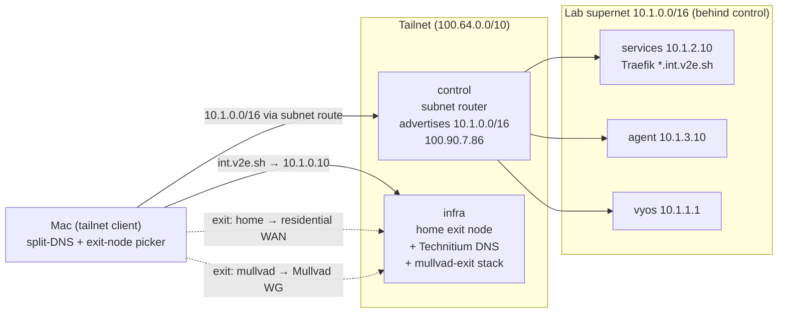
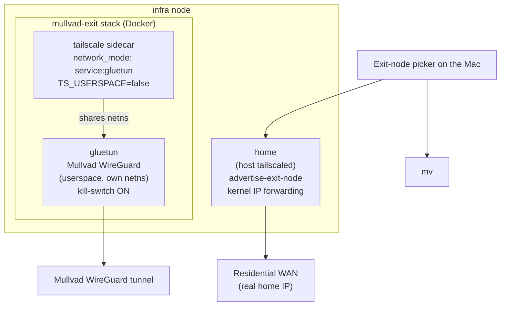
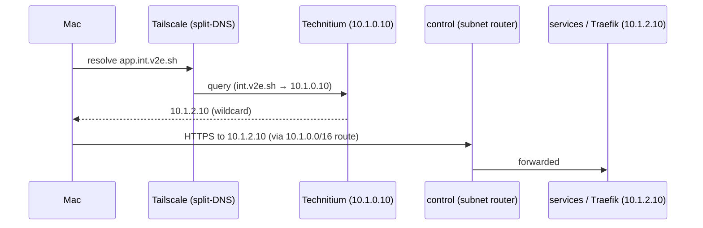

# Tailscale mesh, exit nodes & DNS

How the lab is reached from outside without exposing anything to the WAN: a
Tailscale tailnet with **control as a subnet router**, **two exit nodes** (a
residential `home` egress and a Mullvad `mullvad` egress), and **split-DNS** that
sends `int.v2e.sh` to the Technitium resolver on the infra node.

!!! info "Sources"
    `v2e-ansible/roles/tailscale/{tasks,defaults}/main.yml`,
    `v2e-ansible/playbooks/05-tailscale.yml`,
    `v2e-ansible/inventory/group_vars/{control,infra}.yml`,
    `v2e-compose/mullvad-exit/{compose.yml,README.md}`,
    `v2e-compose/technitium/compose.yml`, and HANDOVER §2.

---

## The shape of it



Only **control** and **infra** are direct tailnet members — Phase 05 targets
`hosts: control:infra` (`playbooks/05-tailscale.yml`). `services` and `agent`
never join the tailnet; they are reached **through control's advertised subnet
route**, so the Mac talks to `10.1.2.10` / `10.1.3.10` as if it were on the lab
LAN.

---

## Joining the tailnet (Ansible)

Phase 05 wraps the upstream `artis3n.tailscale` role. The `tailscale` role
(`roles/tailscale`) codifies what used to be a hand-run `tailscale up`, driven by
per-node variables:

| Variable | control | infra |
|---|---|---|
| `tailscale_node_ssh` | `true` | `true` |
| `tailscale_node_advertise_routes` | `10.1.0.0/16` | `""` |
| `tailscale_node_advertise_exit_node` | *(unset → false)* | `true` |
| `tailscale_node_hostname` | *(OS hostname)* | `home` |

The role assembles the `tailscale up` argument string from those flags
(`--ssh`, `--hostname=`, `--advertise-routes=`, `--advertise-exit-node`) and
brings the node up with the SOPS-provided auth key.

!!! warning "Use a REUSABLE auth key"
    The key comes from SOPS as `tailscale_authkey`. It must be a **reusable**
    key — an ephemeral key drops the node from the tailnet on reboot. If no key
    is present the role **skips with a visible warning** rather than failing the
    unattended first boot.

!!! note "Tailnet-side settings are MANUAL"
    Route approval and split-DNS are **tailnet** settings, not node settings, so
    they are configured **by hand in the Tailscale admin console** and are *not*
    codified in these repos:

    - Approve control's advertised route `10.1.0.0/16`.
    - Set split-DNS `int.v2e.sh` → `10.1.0.10`.
    - Approve each exit node (`home`, `mullvad`) once.

    There is no ACL / tags / `autoApprovers` policy file in the repo tree; that
    policy lives only in the admin console.

Tailscale SSH is enabled on both nodes (`--ssh`), so tailnet identities can SSH
in through Tailscale's own auth layer in addition to the key-based mesh.

---

## Control as subnet router

`control` advertises the whole lab supernet `10.1.0.0/16`. Once that route is
approved in the admin console, any tailnet device (the Mac) routes lab-internal
addresses through control — this is what makes `10.1.2.10` (services/Traefik),
`10.1.3.10` (agent) and `10.1.1.1` (VyOS) reachable without those hosts being on
the tailnet themselves.

---

## The two exit nodes

Two egress options appear side by side in the Tailscale exit-node picker:



### `home` — residential exit (on-host)

The infra node itself advertises as an exit node
(`tailscale_node_advertise_exit_node: true`, labelled `home` via
`tailscale_node_hostname`). Selecting it routes internet traffic out the
**home / residential WAN** — useful for sites that block VPN IP ranges. The role
enables and persists `net.ipv4.ip_forward` and `net.ipv6.conf.all.forwarding`
(as Tailscale requires) whenever a node advertises as an exit node.

!!! note "Naming"
    `tailscale_node_hostname: home` changes only the **tailnet machine name**;
    the VM / lab identity stays `infra`. The flag is authoritative and survives
    re-registration (an admin-console rename would override it, but none is set).

### `mullvad` — privacy exit (Dockerized)

A second, independent exit node runs as the **`mullvad-exit`** compose stack on
the same infra node (enabled via `compose_stack_stacks`). It is two containers:

- **`gluetun`** (`qmcgaw/gluetun:v3.41.1`) holds a **Mullvad WireGuard** tunnel,
  owns its own network namespace, and enables IP forwarding inside that
  namespace. Its **kill-switch stays on** (`FIREWALL_OUTBOUND_SUBNETS` allows
  only the Tailscale CGNAT range `100.64.0.0/10` out, so tailnet peers stay
  reachable but nothing leaks if the tunnel drops).
- **`tailscale`** (`tailscale/tailscale:v1.98.4`) sidecar with
  `network_mode: service:gluetun` — it **shares gluetun's netns**, so all of its
  traffic (and any exit traffic it forwards) leaves through the Mullvad tunnel.
  It advertises `--advertise-exit-node --hostname=mullvad` and only starts once
  gluetun reports healthy (`depends_on: service_healthy`, gated on gluetun's own
  tunnel-up healthcheck).

Both exits reuse the lab's reusable `tailscale_authkey`. The stack is portable —
identical to run standalone on a VPS with the same env (`.env.example`); in the
lab the env is rendered from SOPS by the `compose_stack` role.

!!! tip "Mullvad credentials"
    In the Mullvad portal: **WireGuard configuration → generate a key → download
    the `.conf`**, then take `PrivateKey=` → `mullvad_wireguard_private_key` and
    `Address=` → `mullvad_wireguard_addresses` (into SOPS). The key shown on the
    *Manage devices* page is **not** the private key. On an IPv4-only host, give
    only the IPv4 address — gluetun refuses to start with an IPv6 address it
    can't use.

### Why the Mullvad exit is namespace-isolated (and userspace WireGuard)

Mullvad's WireGuard **rewrites the entire routing table of wherever it runs**.
The mullvad-exit stack contains that blast radius by keeping WireGuard **off the
host**:

- gluetun runs the WireGuard tunnel as a **userspace tunnel inside its own
  container namespace** (hence the mounted `/dev/net/tun` and `NET_ADMIN`). It
  never loads a host kernel module and never touches the host's routing table or
  DNS.
- The Tailscale sidecar joins that same namespace instead of the host network.

This is why it is safe to run the Mullvad exit **right next to** the home
DNS/relay on the infra node. Running Mullvad **directly on the host** would
hijack the node's routes — the exact class of breakage that takes down
`int.v2e.sh` resolution when the Mullvad app runs on the Mac (see the DNS caveat
below). So: **Docker/namespace isolation for the Mullvad exit; on-host for the
residential one.**

!!! warning "Two different 'modes' — don't conflate them"
    - **gluetun's WireGuard** is userspace (in-namespace), by design — that is
      the isolation described above.
    - **The Tailscale sidecar** deliberately runs in **kernel/TUN mode**
      (`TS_USERSPACE=false`), *not* userspace, because exit-node **packet
      forwarding** requires the kernel networking path. Modern Tailscale sets up
      its own exit-node SNAT, so no masquerade sidecar is needed; the
      `mullvad-exit` README documents an `iptables … MASQUERADE` / `FIREWALL=off`
      fallback if forwarded traffic doesn't flow on first deploy.

---

## Split-DNS to Technitium

The tailnet uses **split-DNS**: only the `int.v2e.sh` domain is directed at the
lab resolver; everything else resolves normally on the client.

- **Resolver**: **Technitium** (`technitium/dns-server:15.2.0`) runs on the
  infra node in **host-network** mode, owning the node's `:53` (tcp+udp) and the
  `:5380` admin console. Host networking is used deliberately — port publishing
  would drop client source IPs and break per-client DNS rules. It forwards
  upstream to `1.1.1.1, 9.9.9.9` and is **not** exposed to the WAN.
- **Split-DNS rule** (admin-console, manual): `int.v2e.sh` → `10.1.0.10`.
- **Zone** (`technitium_zone`, Phase 04): the `int.v2e.sh` zone has a wildcard
  `*.int.v2e.sh` → `10.1.2.10` (services / Traefik) plus per-node A records —
  `infra 10.1.0.10`, `control 10.1.1.10`, `services 10.1.2.10`,
  `agent 10.1.3.10`.

So from the Mac: `whoami.int.v2e.sh` → split-DNS → Technitium → `10.1.2.10`, and
the request itself travels over the subnet route through control to the Traefik
host.



---

## The Mac access model

The Mac is a normal tailnet client (HANDOVER §2):

- **Browser apps**: reaches `*.int.v2e.sh` through split-DNS + control's subnet
  route. No app is published to the WAN.
- **RustDesk to the control desktop**: RustDesk → **Direct IP Access** →
  `100.90.7.86` (control's Tailscale IP). Do **not** use the RustDesk ID —
  Direct-IP over Tailscale uses no public relay server.
- **Exit node**: pick `home` (residential) or `mullvad` (privacy) from the
  Tailscale menu as needed.

!!! warning "Mullvad-app-on-the-Mac breaks int.v2e.sh"
    While the **Mullvad VPN app is connected on the Mac**, it hijacks DNS and
    split-DNS to Technitium stops working. Fixes:

    - Disconnect the Mullvad app, **or**
    - Use the Tailscale **`mullvad` exit node** instead of the local app (it
      gives Mullvad egress without touching the Mac's routes/DNS), **or**
    - Pin a native resolver as a reliable fallback:
      ```bash
      echo 'nameserver 10.1.0.10' | sudo tee /etc/resolver/int.v2e.sh
      sudo killall -HUP mDNSResponder
      ```

---

## Version pins

| Component | Image / role | Version |
|---|---|---|
| Tailscale (node) | `artis3n.tailscale` role | `v5.0.1` (`requirements.yml`) |
| Tailscale sidecar | `tailscale/tailscale` | `v1.98.4` |
| gluetun (Mullvad WG) | `qmcgaw/gluetun` | `v3.41.1` |
| Technitium DNS | `technitium/dns-server` | `15.2.0` |
