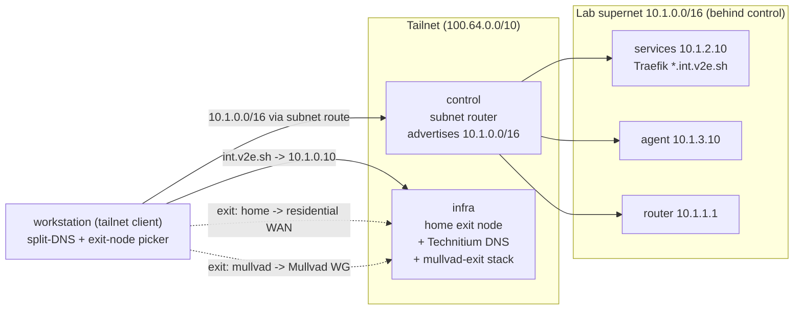
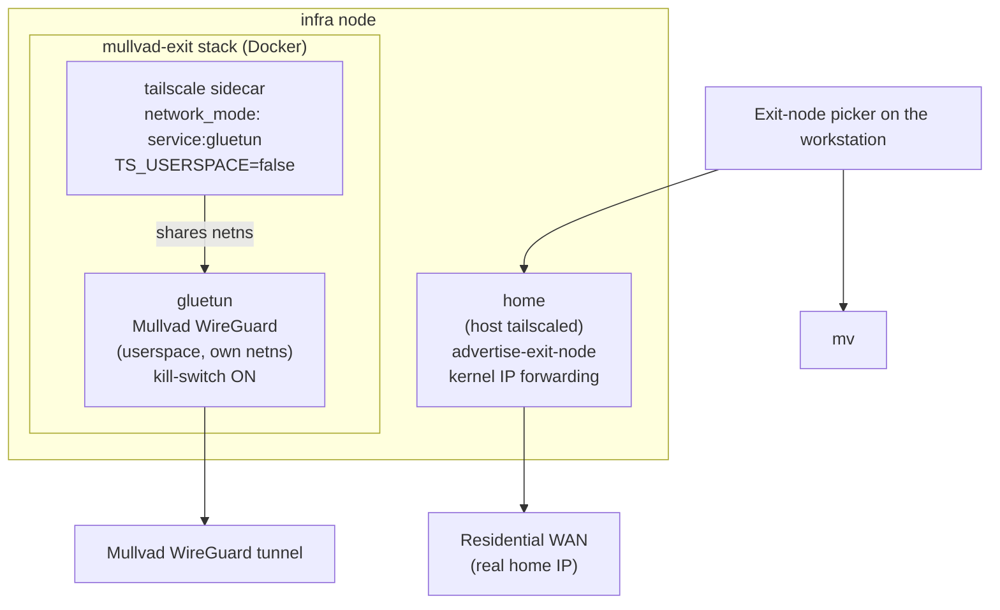
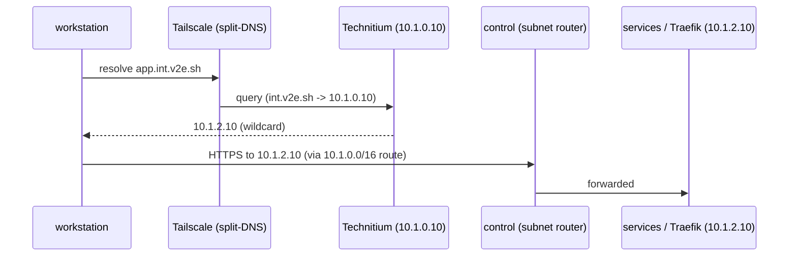

# Tailscale mesh, exit nodes, and DNS

This page describes how the lab is reached from outside without exposing anything
to the WAN. A Tailscale tailnet carries all remote access: the control node acts
as a subnet router for the lab supernet, the infra node offers two exit nodes (a
residential `home` egress and a Mullvad `mullvad` egress), and split-DNS directs
the `int.v2e.sh` domain to the Technitium resolver. Nothing in the lab is
published to the public internet.

Phase 05 (`playbooks/05-tailscale.yml`) joins only the control and infra nodes to
the tailnet. The remaining nodes are reached through control's advertised route,
so they never hold a tailnet identity of their own.

## Topology



Only the control and infra nodes are direct tailnet members; phase 05 targets
`hosts: control:infra` (`playbooks/05-tailscale.yml`). The services and agent
nodes never join the tailnet. They are reached through control's advertised
subnet route, so a tailnet client talks to `10.1.2.10` (services / Traefik) and
`10.1.3.10` (agent) as if it sat on the lab LAN. Node addresses are defined in
`inventory/hosts.ini`.

## Joining the tailnet

The `tailscale` role (`roles/tailscale`) wraps the upstream `artis3n.tailscale`
role, pinned to `v5.0.1` in `requirements.yml`. It codifies what was previously a
hand-run `tailscale up`, driven by per-node variables set in
`inventory/group_vars/{control,infra}.yml`.

| Variable | control | infra |
|---|---|---|
| `tailscale_node_ssh` | `true` | `true` |
| `tailscale_node_advertise_routes` | `10.1.0.0/16` | `""` |
| `tailscale_node_advertise_exit_node` | *(default `false`)* | `true` |
| `tailscale_node_hostname` | *(OS hostname)* | `home` |

The role assembles the `tailscale up` argument string from these flags — `--ssh`,
`--hostname=`, `--advertise-routes=`, and `--advertise-exit-node` — then brings
the node up with the SOPS-provided auth key (`roles/tailscale/tasks/main.yml`).
Tailscale SSH is enabled on both nodes, so tailnet identities can authenticate
through Tailscale's own layer in addition to the key-based mesh.

!!! warning "Use a reusable auth key"
    The auth key is read from SOPS as `tailscale_authkey` and must be a
    **reusable** key. An ephemeral key drops the node from the tailnet on reboot.
    When no key is present, the role skips the join with a visible warning rather
    than failing the unattended first boot.

!!! note "Tailnet-side settings are manual"
    Route approval and split-DNS are tailnet settings, not node settings, so they
    are configured by hand in the Tailscale admin console and are not codified in
    these repos:

    - Approve control's advertised route `10.1.0.0/16`.
    - Set split-DNS `int.v2e.sh` -> `10.1.0.10`.
    - Approve each exit node (`home`, `mullvad`) once.

    No ACL, tag, or `autoApprovers` policy file exists in the repo tree; that
    policy lives only in the admin console.

## Control as subnet router

The control node advertises the entire lab supernet `10.1.0.0/16`
(`tailscale_node_advertise_routes` in `group_vars/control.yml`). Once that route
is approved in the admin console, any tailnet device routes lab-internal
addresses through control. This is what makes `10.1.2.10` (services / Traefik),
`10.1.3.10` (agent), and `10.1.1.1` (the router) reachable without those hosts joining
the tailnet themselves.

## The two exit nodes

Two egress options appear side by side in the Tailscale exit-node picker.



### `home` — residential exit (on-host)

The infra node itself advertises as an exit node
(`tailscale_node_advertise_exit_node: true` in `group_vars/infra.yml`), labelled
`home` through `tailscale_node_hostname`. Selecting it routes internet traffic
out the residential WAN, which is useful for sites that block VPN IP ranges. When
a node advertises as an exit node, the role enables and persists
`net.ipv4.ip_forward` and `net.ipv6.conf.all.forwarding`, as Tailscale requires
(`roles/tailscale/tasks/main.yml`).

!!! note "Naming"
    `tailscale_node_hostname: home` changes only the tailnet machine name; the VM
    and lab identity stay `infra`. The flag is authoritative and survives
    re-registration. An admin-console rename would override it, but none is set.

### `mullvad` — privacy exit (Dockerized)

A second, independent exit node runs as the `mullvad-exit` Docker Compose stack on
the same infra node, enabled by adding `mullvad-exit` to `compose_stack_stacks`
(`group_vars/infra.yml`). It is two containers, defined in
`v2e-compose/mullvad-exit/compose.yml`.

- **`gluetun`** (`qmcgaw/gluetun:v3.41.1`) holds a Mullvad WireGuard tunnel, owns
  its own network namespace, and enables IP forwarding inside that namespace. Its
  kill-switch stays on: `FIREWALL_OUTBOUND_SUBNETS=100.64.0.0/10` permits only the
  Tailscale CGNAT range out, so tailnet peers remain reachable but nothing leaks
  if the tunnel drops.
- **`tailscale`** (`tailscale/tailscale:v1.98.4`) is a sidecar with
  `network_mode: service:gluetun`, sharing gluetun's namespace so all of its
  traffic (and any exit traffic it forwards) leaves through the Mullvad tunnel. It
  runs `--advertise-exit-node --hostname=mullvad` and starts only once gluetun
  reports healthy (`depends_on: condition: service_healthy`, gated on gluetun's
  own tunnel-up healthcheck).

Both exits reuse the lab's reusable `tailscale_authkey`. The stack is portable and
runs standalone on a VPS with the same environment (`.env.example`); in the lab
the environment is rendered from SOPS by the `compose_stack` role. The required
secrets — `mullvad_wireguard_private_key`, `mullvad_wireguard_addresses`, and
`tailscale_authkey` — are declared in `compose_stack_required_secrets`
(`group_vars/infra.yml`).

!!! tip "Mullvad credentials"
    In the Mullvad portal, open **WireGuard configuration -> generate a key ->
    download the `.conf`**, then map `PrivateKey=` ->
    `mullvad_wireguard_private_key` and `Address=` ->
    `mullvad_wireguard_addresses` into SOPS. The key shown on the *Manage devices*
    page is not the private key. On an IPv4-only host, supply only the IPv4
    address; gluetun refuses to start with an IPv6 address it cannot use.

### Namespace isolation and userspace WireGuard

Mullvad's WireGuard rewrites the entire routing table of wherever it runs. The
`mullvad-exit` stack contains that blast radius by keeping WireGuard off the host.

- gluetun runs the WireGuard tunnel as a userspace tunnel inside its own container
  namespace (hence the mounted `/dev/net/tun` and `NET_ADMIN` capability). It
  never loads a host kernel module and never touches the host's routing table or
  DNS.
- The Tailscale sidecar joins that same namespace instead of the host network.

This isolation is why the Mullvad exit runs safely beside the home DNS and relay
on the infra node. Running Mullvad directly on the host would hijack the node's
routes — the same class of breakage that takes down `int.v2e.sh` resolution when
the Mullvad app runs on the workstation (see the DNS caveat below). The design is
therefore deliberate: Docker and namespace isolation for the Mullvad exit,
on-host for the residential one.

!!! warning "Two WireGuard modes — do not conflate them"
    - **gluetun's WireGuard** is userspace and in-namespace by design. That is the
      isolation described above.
    - **The Tailscale sidecar** deliberately runs in kernel/TUN mode
      (`TS_USERSPACE=false`), because exit-node packet forwarding requires the
      kernel networking path. Modern Tailscale sets up its own exit-node SNAT, so
      no masquerade sidecar is needed; the `mullvad-exit` README documents an
      `iptables … MASQUERADE` or `FIREWALL=off` fallback if forwarded traffic does
      not flow on first deploy.

## Split-DNS to Technitium

The tailnet uses split-DNS: only the `int.v2e.sh` domain is directed at the lab
resolver, and everything else resolves normally on the client.

- **Resolver** — Technitium (`technitium/dns-server:15.2.0`) runs on the infra
  node in host-network mode (`v2e-compose/technitium/compose.yml`), owning the
  node's `:53` (tcp+udp) and the `:5380` admin console. Host networking is
  deliberate: port publishing would drop client source IPs and break per-client
  DNS rules. Technitium forwards upstream to `1.1.1.1, 9.9.9.9`
  (`technitium_forwarders` / `infra_upstream_nameservers` in `group_vars/infra.yml`)
  and is not exposed to the WAN.
- **Split-DNS rule** (admin console, manual) — `int.v2e.sh` -> `10.1.0.10`.
- **Zone** (`technitium_zone`, Phase 04) — the `int.v2e.sh` zone carries a
  wildcard `*.int.v2e.sh` -> `10.1.2.10` (services / Traefik) plus per-node A
  records from `technitium_zone_records`: `infra 10.1.0.10`, `control 10.1.1.10`,
  `services 10.1.2.10`, `agent 10.1.3.10`.

From the workstation, `whoami.int.v2e.sh` resolves through split-DNS to Technitium, which
returns `10.1.2.10`; the request itself then travels over the subnet route through
control to the Traefik host.



## The workstation access model

The workstation is an ordinary tailnet client and reaches the lab through the mesh alone.

- **Browser apps** — reaches `*.int.v2e.sh` through split-DNS and control's subnet
  route. No app is published to the WAN.
- **RustDesk to the control desktop** — RustDesk connects by **Direct IP Access**
  to control's Tailscale address, not the RustDesk ID, so the session uses no
  public relay. The control desktop and RustDesk client are provisioned in
  phase 06 (`control_desktop_*` / `rustdesk_client_*` in `group_vars/control.yml`).
- **Exit node** — select `home` (residential) or `mullvad` (privacy) from the
  Tailscale menu as needed.

!!! warning "The Mullvad app on the workstation breaks int.v2e.sh"
    While the Mullvad VPN app is connected on the workstation, it hijacks DNS and
    split-DNS to Technitium stops working. Any of the following resolves it:

    - Disconnect the Mullvad app, or
    - Use the Tailscale `mullvad` exit node instead of the local app — it provides
      Mullvad egress without touching the workstation's routes or DNS, or
    - Pin a native resolver as a reliable fallback:
      ```bash
      echo 'nameserver 10.1.0.10' | sudo tee /etc/resolver/int.v2e.sh
      sudo killall -HUP mDNSResponder
      ```

## Version pins

| Component | Image / role | Version |
|---|---|---|
| Tailscale (node) | `artis3n.tailscale` | `v5.0.1` (`requirements.yml`) |
| Tailscale sidecar | `tailscale/tailscale` | `v1.98.4` |
| gluetun (Mullvad WG) | `qmcgaw/gluetun` | `v3.41.1` |
| Technitium DNS | `technitium/dns-server` | `15.2.0` |

## Related

- [Network, VLANs & firewall](networking.md) — the lab supernet, VLANs, node
  addressing, and the VyOS router behind control's subnet route.
- [Architecture overview](architecture.md) — how the control, infra, services, and
  agent nodes fit together.
- [Application estate](applications.md) — the `*.int.v2e.sh` apps reached through
  split-DNS and Traefik.
- [Secrets & SOPS flow](secrets.md) — how `tailscale_authkey` and the Mullvad
  WireGuard credentials are rendered into node environments.
